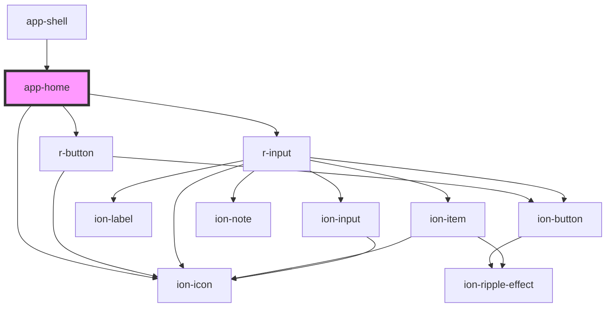

# app-home

<!-- Auto Generated Below -->

## Dependencies

### Used by

 - [app-shell](../app-shell)

### Depends on

- ion-icon
- [r-button](../r-button)
- [r-input](../r-input)

### Graph

----------------------------------------------

*Built with [StencilJS](https://stenciljs.com/)*
