# app-home

<!-- Auto Generated Below -->

## Dependencies

### Used by

 - [app-shell](../app-shell)

### Depends on

- ion-icon
- [r-button](../r-button)
- [r-input](../r-input)
- [r-dropdown](../r-dropdown)
- ion-select-option
- [r-datepicker](../r-datepicker)
- [r-alert](../r-alert)
- [r-header](../r-header)
- ion-buttons
- ion-button
- [r-toolbar](../r-toolbar)
- ion-title
- [r-title](../r-title)
- [r-buttons](../r-buttons)
- [r-badge](../r-badge)
- [r-card](../r-card)
- [r-card-header](../r-card-header)
- [r-card-title](../r-card-title)
- [r-card-subtitle](../r-card-subtitle)
- [r-card-content](../r-card-content)
- [r-card-footer](../r-card-footer)
- [r-checkbox](../r-checkbox)
- [r-toggle](../r-toggle)
- [r-tabs](../r-tabs)
- [r-tab](../r-tab)
- [r-tab-bar](../r-tab-bar)
- [r-tab-button](../r-tab-button)
- ion-label

### Graph

```mermaid
graph TD;
  app-home --> ion-icon
  app-home --> r-button
  app-home --> r-input
  app-home --> r-dropdown
  app-home --> ion-select-option
  app-home --> r-datepicker
  app-home --> r-alert
  app-home --> r-header
  app-home --> ion-buttons
  app-home --> ion-button
  app-home --> r-toolbar
  app-home --> ion-title
  app-home --> r-title
  app-home --> r-buttons
  app-home --> r-badge
  app-home --> r-card
  app-home --> r-card-header
  app-home --> r-card-title
  app-home --> r-card-subtitle
  app-home --> r-card-content
  app-home --> r-card-footer
  app-home --> r-checkbox
  app-home --> r-toggle
  app-home --> r-tabs
  app-home --> r-tab
  app-home --> r-tab-bar
  app-home --> r-tab-button
  app-home --> ion-label
  r-button --> ion-button
  r-button --> ion-icon
  ion-button --> ion-ripple-effect
  r-input --> ion-item
  r-input --> ion-label
  r-input --> ion-input
  r-input --> ion-button
  r-input --> ion-icon
  r-input --> ion-note
  ion-item --> ion-icon
  ion-item --> ion-ripple-effect
  ion-input --> ion-icon
  r-dropdown --> ion-item
  r-dropdown --> ion-label
  r-dropdown --> ion-select
  r-dropdown --> ion-note
  ion-select --> ion-select-popover
  ion-select --> ion-popover
  ion-select --> ion-action-sheet
  ion-select --> ion-alert
  ion-select --> ion-select-modal
  ion-select --> ion-modal
  ion-select --> ion-icon
  ion-select-popover --> ion-item
  ion-select-popover --> ion-checkbox
  ion-select-popover --> ion-radio-group
  ion-select-popover --> ion-radio
  ion-select-popover --> ion-list
  ion-select-popover --> ion-list-header
  ion-select-popover --> ion-label
  ion-popover --> ion-backdrop
  ion-action-sheet --> ion-backdrop
  ion-action-sheet --> ion-icon
  ion-action-sheet --> ion-ripple-effect
  ion-alert --> ion-ripple-effect
  ion-alert --> ion-backdrop
  ion-select-modal --> ion-radio-group
  ion-select-modal --> ion-item
  ion-select-modal --> ion-radio
  ion-select-modal --> ion-checkbox
  ion-select-modal --> ion-header
  ion-select-modal --> ion-toolbar
  ion-select-modal --> ion-title
  ion-select-modal --> ion-buttons
  ion-select-modal --> ion-button
  ion-select-modal --> ion-content
  ion-select-modal --> ion-list
  ion-modal --> ion-backdrop
  r-datepicker --> ion-item
  r-datepicker --> ion-label
  r-datepicker --> ion-datetime
  r-datepicker --> ion-note
  ion-datetime --> ion-buttons
  ion-datetime --> ion-button
  ion-datetime --> ion-picker
  ion-datetime --> ion-picker-column
  ion-datetime --> ion-picker-column-option
  ion-datetime --> ion-icon
  ion-datetime --> ion-ripple-effect
  ion-datetime --> ion-popover
  r-alert --> ion-alert
  r-header --> ion-header
  r-header --> ion-toolbar
  r-header --> ion-title
  r-toolbar --> ion-toolbar
  r-title --> ion-title
  r-buttons --> ion-buttons
  r-badge --> ion-badge
  r-card --> ion-card
  ion-card --> ion-ripple-effect
  r-card-header --> ion-card-header
  r-card-title --> ion-card-title
  r-card-subtitle --> ion-card-subtitle
  r-card-content --> ion-card-content
  r-checkbox --> ion-item
  r-checkbox --> ion-label
  r-checkbox --> ion-checkbox
  r-checkbox --> ion-note
  r-toggle --> ion-item
  r-toggle --> ion-label
  r-toggle --> ion-toggle
  r-toggle --> ion-note
  ion-toggle --> ion-icon
  r-tabs --> ion-tabs
  r-tab --> ion-tab
  r-tab-bar --> ion-tab-bar
  r-tab-button --> ion-tab-button
  ion-tab-button --> ion-ripple-effect
  app-shell --> app-home
  style app-home fill:#f9f,stroke:#333,stroke-width:4px
```

----------------------------------------------

*Built with [StencilJS](https://stenciljs.com/)*
