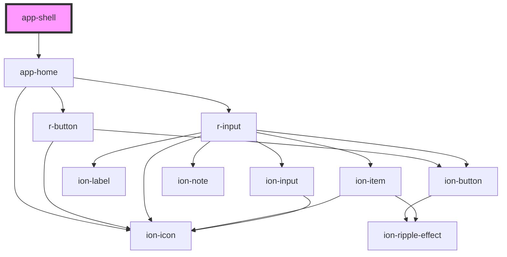

# app-shell

<!-- Auto Generated Below -->

## Dependencies

### Depends on

- [app-home](../app-home)

### Graph

----------------------------------------------

*Built with [StencilJS](https://stenciljs.com/)*
