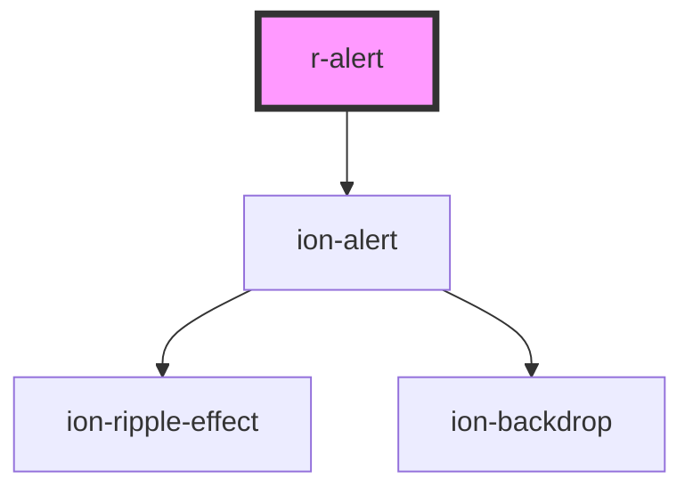

# r-alert

<!-- Auto Generated Below -->

## Properties

| Property          | Attribute          | Description                                                                                                                                                                           | Type                                                                                                            | Default     |
| ----------------- | ------------------ | ------------------------------------------------------------------------------------------------------------------------------------------------------------------------------------- | --------------------------------------------------------------------------------------------------------------- | ----------- |
| `animated`        | `animated`         | If true, the alert is animated                                                                                                                                                        | `boolean`                                                                                                       | `true`      |
| `backdropDismiss` | `backdrop-dismiss` | If true, the alert can be dismissed by clicking the backdrop                                                                                                                          | `boolean`                                                                                                       | `true`      |
| `buttons`         | `buttons`          | Alert buttons configuration Can be a string (single button text) or an array of button objects Example: "OK" or [{ text: "Cancel", role: "cancel" }, { text: "OK", role: "confirm" }] | `string \| ({ text: string; role?: string; handler?: () => void; }[])`                                          | `undefined` |
| `color`           | `color`            | The alert color (Ionic color)                                                                                                                                                         | `"danger" \| "dark" \| "light" \| "medium" \| "primary" \| "secondary" \| "success" \| "tertiary" \| "warning"` | `undefined` |
| `header`          | `header`           | The alert header text                                                                                                                                                                 | `string`                                                                                                        | `undefined` |
| `isOpen`          | `is-open`          | If true, the alert is open                                                                                                                                                            | `boolean`                                                                                                       | `false`     |
| `keyboardClose`   | `keyboard-close`   | If true, the alert can be dismissed by pressing the escape key                                                                                                                        | `boolean`                                                                                                       | `true`      |
| `message`         | `message`          | The alert message text                                                                                                                                                                | `string`                                                                                                        | `undefined` |
| `subHeader`       | `sub-header`       | The alert subheader text                                                                                                                                                              | `string`                                                                                                        | `undefined` |
| `translucent`     | `translucent`      | If true, the alert is translucent                                                                                                                                                     | `boolean`                                                                                                       | `false`     |

## Events

| Event          | Description                         | Type                            |
| -------------- | ----------------------------------- | ------------------------------- |
| `rDidDismiss`  | Emitted when the alert is dismissed | `CustomEvent<CustomEvent<any>>` |
| `rDidPresent`  | Emitted when the alert is presented | `CustomEvent<CustomEvent<any>>` |
| `rWillDismiss` | Emitted when the alert will dismiss | `CustomEvent<CustomEvent<any>>` |
| `rWillPresent` | Emitted when the alert will present | `CustomEvent<CustomEvent<any>>` |

## Dependencies

### Depends on

- ion-alert

### Graph

----------------------------------------------

*Built with [StencilJS](https://stenciljs.com/)*
