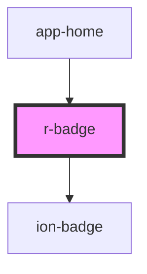

# r-badge

Badge component that wraps Ionic badge. Used to display small pieces of information like notification counts, status indicators, or labels with design system styling.

## Usage

Badges are typically used to display:
- Notification counts (e.g., unread messages)
- Status indicators (e.g., "New", "Active")
- Labels or tags
- Numeric indicators

### Basic Badge

```html
<r-badge>5</r-badge>
```

### Badge with Color

```html
<r-badge color="primary">12</r-badge>
<r-badge color="danger">99+</r-badge>
<r-badge color="success">New</r-badge>
```

### Badge on Button

```html
<ion-button color="primary">
  <ion-icon slot="icon-only" name="notifications-outline"></ion-icon>
  <r-badge color="danger">5</r-badge>
</ion-button>
```

### Badge on Icon

```html
<div style="position: relative; display: inline-block;">
  <ion-icon name="mail-outline"></ion-icon>
  <r-badge color="primary" style="position: absolute; top: -5px; right: -5px;">3</r-badge>
</div>
```

<!-- Auto Generated Below -->


## Properties

| Property | Attribute | Description                   | Type                                                                                                            | Default     |
| -------- | --------- | ----------------------------- | --------------------------------------------------------------------------------------------------------------- | ----------- |
| `color`  | `color`   | The badge color (Ionic color) | `"danger" \| "dark" \| "light" \| "medium" \| "primary" \| "secondary" \| "success" \| "tertiary" \| "warning"` | `undefined` |
| `mode`   | `mode`    | The badge mode (ios or md)    | `"ios" \| "md"`                                                                                                 | `undefined` |


## Dependencies

### Used by

 - [app-home](../app-home)

### Depends on

- ion-badge

### Graph


----------------------------------------------

*Built with [StencilJS](https://stenciljs.com/)*
