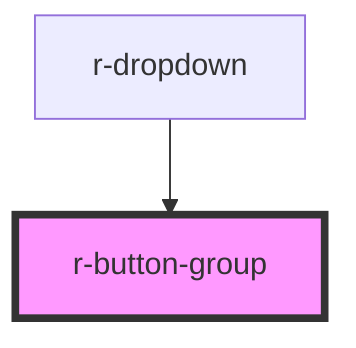

# r-button-group

<!-- Auto Generated Below -->

## Properties

| Property    | Attribute   | Description                               | Type                                                                     | Default        |
| ----------- | ----------- | ----------------------------------------- | ------------------------------------------------------------------------ | -------------- |
| `direction` | `direction` | Display direction                         | `"horizontal" \| "vertical"`                                             | `'horizontal'` |
| `size`      | `size`      | Control the size of buttons in this group | `"default" \| "large" \| "small"`                                        | `undefined`    |
| `type`      | `type`      | Control the type of buttons in this group | `"danger" \| "default" \| "info" \| "primary" \| "success" \| "warning"` | `undefined`    |

## Dependencies

### Used by

 - [r-dropdown](../r-dropdown)

### Graph

----------------------------------------------

*Built with [StencilJS](https://stenciljs.com/)*
