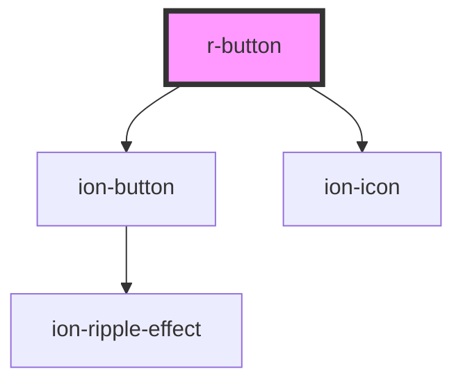

# r-button

<!-- Auto Generated Below -->

## Properties

| Property       | Attribute       | Description                                     | Type                                                                                                            | Default     |
| -------------- | --------------- | ----------------------------------------------- | --------------------------------------------------------------------------------------------------------------- | ----------- |
| `color`        | `color`         | The button color (Ionic color)                  | `"danger" \| "dark" \| "light" \| "medium" \| "primary" \| "secondary" \| "success" \| "tertiary" \| "warning"` | `undefined` |
| `disabled`     | `disabled`      | If true, the button is disabled                 | `boolean`                                                                                                       | `false`     |
| `expand`       | `expand`        | If true, the button takes full width            | `"block" \| "full"`                                                                                             | `undefined` |
| `fill`         | `fill`          | Button fill style                               | `"clear" \| "default" \| "outline" \| "solid"`                                                                  | `undefined` |
| `icon`         | `icon`          | Icon name (Ionic icon name)                     | `string`                                                                                                        | `undefined` |
| `iconOnly`     | `icon-only`     | If true, shows only the icon (icon-only button) | `boolean`                                                                                                       | `false`     |
| `iconPosition` | `icon-position` | Icon position                                   | `"end" \| "start"`                                                                                              | `undefined` |
| `shape`        | `shape`         | Button shape                                    | `"round"`                                                                                                       | `undefined` |
| `size`         | `size`          | The button size                                 | `"default" \| "large" \| "small"`                                                                               | `undefined` |
| `type`         | `type`          | The button type (button, submit, reset)         | `"button" \| "reset" \| "submit"`                                                                               | `'button'`  |

## Events

| Event    | Description                        | Type                      |
| -------- | ---------------------------------- | ------------------------- |
| `rClick` | Emitted when the button is clicked | `CustomEvent<MouseEvent>` |

## Dependencies

### Depends on

- ion-button
- ion-icon

### Graph

----------------------------------------------

*Built with [StencilJS](https://stenciljs.com/)*
