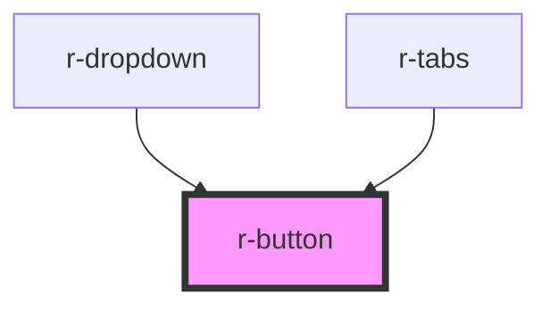

# r-button

<!-- Auto Generated Below -->

## Properties

| Property          | Attribute           | Description                                      | Type                                                                     | Default     |
| ----------------- | ------------------- | ------------------------------------------------ | ------------------------------------------------------------------------ | ----------- |
| `autoInsertSpace` | `auto-insert-space` | Auto insert space between two Chinese characters | `boolean`                                                                | `false`     |
| `autofocus`       | `autofocus`         | Native button autofocus                          | `boolean`                                                                | `false`     |
| `bg`              | `bg`                | Text button with background on hover             | `boolean`                                                                | `false`     |
| `circle`          | `circle`            | Circle button (for icon-only)                    | `boolean`                                                                | `false`     |
| `color`           | `color`             | Custom button color                              | `string`                                                                 | `undefined` |
| `dark`            | `dark`              | Dark mode (auto-adjusts custom color)            | `boolean`                                                                | `false`     |
| `disabled`        | `disabled`          | Disabled state                                   | `boolean`                                                                | `false`     |
| `icon`            | `icon`              | Icon (renders before text)                       | `string`                                                                 | `undefined` |
| `link`            | `link`              | Link button style                                | `boolean`                                                                | `false`     |
| `loading`         | `loading`           | Loading state                                    | `boolean`                                                                | `false`     |
| `loadingIcon`     | `loading-icon`      | Custom loading icon (slot name or icon name)     | `string`                                                                 | `undefined` |
| `nativeType`      | `native-type`       | Native button type                               | `"button" \| "reset" \| "submit"`                                        | `'button'`  |
| `plain`           | `plain`             | Plain style (lighter background)                 | `boolean`                                                                | `false`     |
| `round`           | `round`             | Round button                                     | `boolean`                                                                | `false`     |
| `size`            | `size`              | Button size                                      | `"default" \| "large" \| "small"`                                        | `'default'` |
| `tag`             | `tag`               | Custom HTML tag                                  | `string`                                                                 | `'button'`  |
| `text`            | `text`              | Text button (no background/border)               | `boolean`                                                                | `false`     |
| `type`            | `type`              | Button type (color theme)                        | `"danger" \| "default" \| "info" \| "primary" \| "success" \| "warning"` | `'default'` |

## Events

| Event     | Description | Type                      |
| --------- | ----------- | ------------------------- |
| `clicked` | Click event | `CustomEvent<MouseEvent>` |

## Methods

### `getDisabled() => Promise<boolean>`

Expose disabled state

#### Returns

Type: `Promise<boolean>`

### `getRef() => Promise<HTMLElement>`

Expose button element ref

#### Returns

Type: `Promise<HTMLElement>`

### `getSize() => Promise<ButtonSize>`

Expose size

#### Returns

Type: `Promise<ButtonSize>`

### `getType() => Promise<ButtonType>`

Expose type

#### Returns

Type: `Promise<ButtonType>`

## Dependencies

### Used by

 - [r-dropdown](../r-dropdown)
 - [r-tabs](../r-tabs)

### Graph

----------------------------------------------

*Built with [StencilJS](https://stenciljs.com/)*
