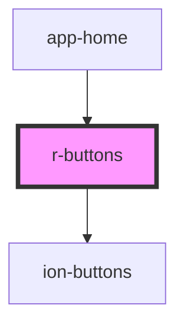

# r-buttons

Buttons container component that wraps Ionic buttons. Groups multiple buttons together, typically used in toolbars and headers with design system spacing.

## Differences: r-buttons vs ion-buttons

### **Regular `ion-buttons` (Ionic Native)**
- Direct Ionic component
- Basic container for grouping buttons
- Minimal styling
- Requires manual configuration

```html
<ion-buttons slot="end">
  <ion-button>
    <ion-icon slot="icon-only" name="search-outline"></ion-icon>
  </ion-button>
</ion-buttons>
```

### **`r-buttons` (Our Design System Wrapper)**
- Wraps `ion-buttons` with design system integration
- Consistent spacing using design tokens
- Better integration with other `r-*` components
- Same functionality as `ion-buttons` but with design system benefits

```html
<r-buttons slot="end">
  <ion-button>
    <ion-icon slot="icon-only" name="search-outline"></ion-icon>
  </ion-button>
</r-buttons>
```

## Key Differences

| Feature | `ion-buttons` | `r-buttons` |
|---------|---------------|-------------|
| **Design Tokens** | ❌ No | ✅ Yes - uses `--r-spacing-2` for gap |
| **Consistency** | Manual styling | Automatic spacing |
| **Integration** | Works with Ionic | Works with Ionic + Design System |
| **Functionality** | ✅ Full Ionic support | ✅ Full Ionic support (pass-through) |
| **Collapse** | ✅ Supported | ✅ Supported (pass-through) |
| **Styling** | Manual CSS | Design system tokens |

## When to Use r-buttons vs ion-buttons

### ✅ **Use `r-buttons` when:**
- You want consistent spacing from design tokens
- You're using other `r-*` components (r-toolbar, r-header)
- You want automatic design system integration
- You want future-proof styling that follows design tokens

### ✅ **Use `ion-buttons` when:**
- You need direct Ionic control without wrapper
- You're not using the design system
- You need custom styling that doesn't follow design tokens

<!-- Auto Generated Below -->


## Properties

| Property   | Attribute  | Description                                                                                 | Type      | Default     |
| ---------- | ---------- | ------------------------------------------------------------------------------------------- | --------- | ----------- |
| `collapse` | `collapse` | If true, the buttons will collapse when the content scrolls.                                | `boolean` | `undefined` |
| `slot`     | `slot`     | The slot where the buttons should be placed. Can be "start", "end", or "primary" (default). | `string`  | `undefined` |


## Dependencies

### Used by

 - [app-home](../app-home)

### Depends on

- ion-buttons

### Graph


----------------------------------------------

*Built with [StencilJS](https://stenciljs.com/)*
