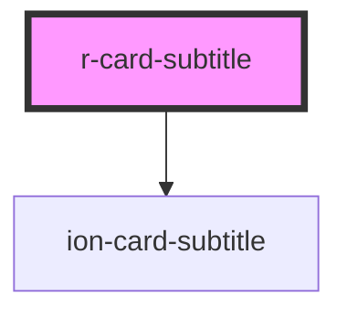

# r-card-subtitle

<!-- Auto Generated Below -->

## Properties

| Property | Attribute | Description                           | Type                                                                                                            | Default     |
| -------- | --------- | ------------------------------------- | --------------------------------------------------------------------------------------------------------------- | ----------- |
| `color`  | `color`   | The card subtitle color (Ionic color) | `"danger" \| "dark" \| "light" \| "medium" \| "primary" \| "secondary" \| "success" \| "tertiary" \| "warning"` | `undefined` |

## Dependencies

### Depends on

- ion-card-subtitle

### Graph

----------------------------------------------

*Built with [StencilJS](https://stenciljs.com/)*
