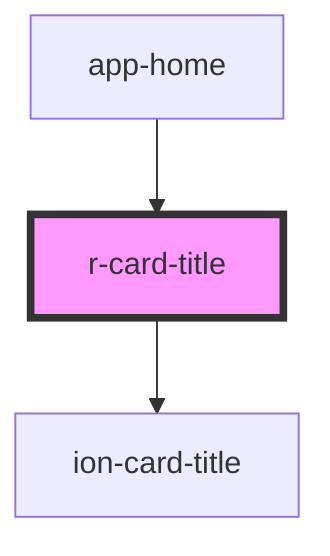

# r-card-title

<!-- Auto Generated Below -->

## Properties

| Property | Attribute | Description                        | Type                                                                                                            | Default     |
| -------- | --------- | ---------------------------------- | --------------------------------------------------------------------------------------------------------------- | ----------- |
| `color`  | `color`   | The card title color (Ionic color) | `"danger" \| "dark" \| "light" \| "medium" \| "primary" \| "secondary" \| "success" \| "tertiary" \| "warning"` | `undefined` |

## Dependencies

### Used by

 - [app-home](../app-home)

### Depends on

- ion-card-title

### Graph

----------------------------------------------

*Built with [StencilJS](https://stenciljs.com/)*
