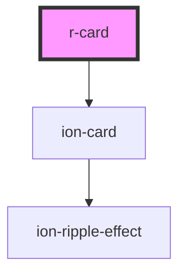

# r-card

<!-- Auto Generated Below -->

## Properties

| Property          | Attribute          | Description                                                                    | Type                                                                                                            | Default     |
| ----------------- | ------------------ | ------------------------------------------------------------------------------ | --------------------------------------------------------------------------------------------------------------- | ----------- |
| `button`          | `button`           | If true, the card acts as a button and becomes clickable                       | `boolean`                                                                                                       | `false`     |
| `color`           | `color`            | The card color (Ionic color)                                                   | `"danger" \| "dark" \| "light" \| "medium" \| "primary" \| "secondary" \| "success" \| "tertiary" \| "warning"` | `undefined` |
| `disabled`        | `disabled`         | If true, the card is disabled                                                  | `boolean`                                                                                                       | `false`     |
| `download`        | `download`         | The download attribute for links                                               | `string`                                                                                                        | `undefined` |
| `href`            | `href`             | The URL to navigate to when the card is clicked (only works if button is true) | `string`                                                                                                        | `undefined` |
| `mode`            | `mode`             | The card mode (ios or md)                                                      | `"ios" \| "md"`                                                                                                 | `undefined` |
| `rel`             | `rel`              | The rel attribute for links                                                    | `string`                                                                                                        | `undefined` |
| `routerDirection` | `router-direction` | The router direction (forward, back, root) for navigation                      | `"back" \| "forward" \| "root"`                                                                                 | `undefined` |
| `target`          | `target`           | The target attribute for links                                                 | `string`                                                                                                        | `undefined` |

## Dependencies

### Depends on

- ion-card

### Graph

----------------------------------------------

*Built with [StencilJS](https://stenciljs.com/)*
