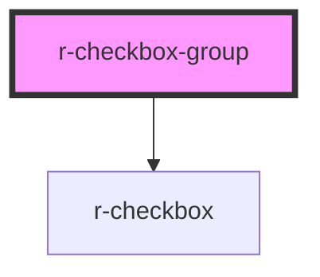

# r-checkbox-group

<!-- Auto Generated Below -->

## Properties

| Property   | Attribute  | Description                                       | Type                              | Default     |
| ---------- | ---------- | ------------------------------------------------- | --------------------------------- | ----------- |
| `disabled` | `disabled` | Whether all checkboxes are disabled               | `boolean`                         | `false`     |
| `max`      | `max`      | Maximum number of checkboxes that can be checked  | `number`                          | `undefined` |
| `min`      | `min`      | Minimum number of checkboxes that must be checked | `number`                          | `undefined` |
| `options`  | --         | Options data for quick setup                      | `CheckboxOption[]`                | `[]`        |
| `size`     | `size`     | Size of checkboxes                                | `"default" \| "large" \| "small"` | `'default'` |
| `value`    | --         | Binding value (array of selected values)          | `(string \| number)[]`            | `[]`        |
| `vertical` | `vertical` | Vertical layout                                   | `boolean`                         | `false`     |

## Events

| Event    | Description | Type                                |
| -------- | ----------- | ----------------------------------- |
| `change` |             | `CustomEvent<(string \| number)[]>` |

## Dependencies

### Depends on

- [r-checkbox](../r-checkbox)

### Graph

----------------------------------------------

*Built with [StencilJS](https://stenciljs.com/)*
