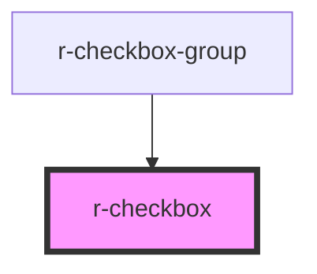

# r-checkbox

<!-- Auto Generated Below -->

## Properties

| Property        | Attribute       | Description                                        | Type                              | Default     |
| --------------- | --------------- | -------------------------------------------------- | --------------------------------- | ----------- |
| `border`        | `border`        | Whether to add a border around the checkbox        | `boolean`                         | `false`     |
| `checked`       | `checked`       | Whether the checkbox is checked                    | `boolean`                         | `false`     |
| `disabled`      | `disabled`      | Whether the checkbox is disabled                   | `boolean`                         | `false`     |
| `falseValue`    | `false-value`   | False value for v-model                            | `any`                             | `false`     |
| `indeterminate` | `indeterminate` | Whether the checkbox is in indeterminate state     | `boolean`                         | `false`     |
| `inputName`     | `name`          | Native name attribute                              | `string`                          | `undefined` |
| `label`         | `label`         | The label text                                     | `string`                          | `undefined` |
| `size`          | `size`          | Size of the checkbox                               | `"default" \| "large" \| "small"` | `'default'` |
| `trueValue`     | `true-value`    | True value for v-model                             | `any`                             | `true`      |
| `value`         | `value`         | The value of the checkbox (used in checkbox-group) | `boolean \| number \| string`     | `undefined` |

## Events

| Event    | Description | Type                   |
| -------- | ----------- | ---------------------- |
| `change` |             | `CustomEvent<boolean>` |

## Dependencies

### Used by

 - [r-checkbox-group](../r-checkbox-group)

### Graph

----------------------------------------------

*Built with [StencilJS](https://stenciljs.com/)*
