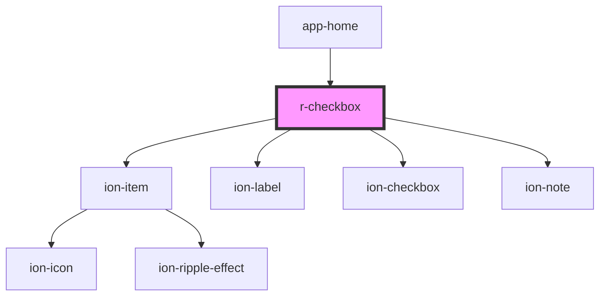

# r-checkbox

<!-- Auto Generated Below -->

## Properties

| Property         | Attribute         | Description                                                                            | Type                                                                                                            | Default     |
| ---------------- | ----------------- | -------------------------------------------------------------------------------------- | --------------------------------------------------------------------------------------------------------------- | ----------- |
| `alignment`      | `alignment`       | Checkbox alignment (start or center)                                                   | `"center" \| "start"`                                                                                           | `undefined` |
| `checked`        | `checked`         | If true, the checkbox is checked                                                       | `boolean`                                                                                                       | `false`     |
| `color`          | `color`           | The checkbox color (Ionic color)                                                       | `"danger" \| "dark" \| "light" \| "medium" \| "primary" \| "secondary" \| "success" \| "tertiary" \| "warning"` | `undefined` |
| `disabled`       | `disabled`        | If true, the checkbox is disabled                                                      | `boolean`                                                                                                       | `false`     |
| `error`          | `error`           | If true, the checkbox has error state                                                  | `boolean`                                                                                                       | `false`     |
| `errorText`      | `error-text`      | Error message to display                                                               | `string`                                                                                                        | `undefined` |
| `fill`           | `fill`            | The fill style (only applies when formField is true)                                   | `"clear" \| "default" \| "outline" \| "solid"`                                                                  | `undefined` |
| `formField`      | `form-field`      | If true, wraps checkbox in ion-item for form field styling                             | `boolean`                                                                                                       | `false`     |
| `helperText`     | `helper-text`     | Helper text to display                                                                 | `string`                                                                                                        | `undefined` |
| `indeterminate`  | `indeterminate`   | If true, the checkbox is in an indeterminate state (useful for "select all" scenarios) | `boolean`                                                                                                       | `false`     |
| `justify`        | `justify`         | Justify content (start, end, space-between)                                            | `"end" \| "space-between" \| "start"`                                                                           | `undefined` |
| `label`          | `label`           | The checkbox label                                                                     | `string`                                                                                                        | `undefined` |
| `labelPlacement` | `label-placement` | Label placement relative to the checkbox                                               | `"end" \| "fixed" \| "stacked" \| "start"`                                                                      | `undefined` |
| `mode`           | `mode`            | The checkbox mode (ios or md)                                                          | `"ios" \| "md"`                                                                                                 | `undefined` |
| `name`           | `name`            | The checkbox name (for form submission)                                                | `string`                                                                                                        | `undefined` |
| `required`       | `required`        | If true, the checkbox is required                                                      | `boolean`                                                                                                       | `false`     |
| `value`          | `value`           | The checkbox value                                                                     | `string`                                                                                                        | `undefined` |

## Events

| Event     | Description                                     | Type                            |
| --------- | ----------------------------------------------- | ------------------------------- |
| `rBlur`   | Emitted when the checkbox is blurred            | `CustomEvent<CustomEvent<any>>` |
| `rChange` | Emitted when the checkbox checked state changes | `CustomEvent<CustomEvent<any>>` |
| `rFocus`  | Emitted when the checkbox is focused            | `CustomEvent<CustomEvent<any>>` |

## Dependencies

### Used by

 - [app-home](../app-home)

### Depends on

- ion-item
- ion-label
- ion-checkbox
- ion-note

### Graph

----------------------------------------------

*Built with [StencilJS](https://stenciljs.com/)*
