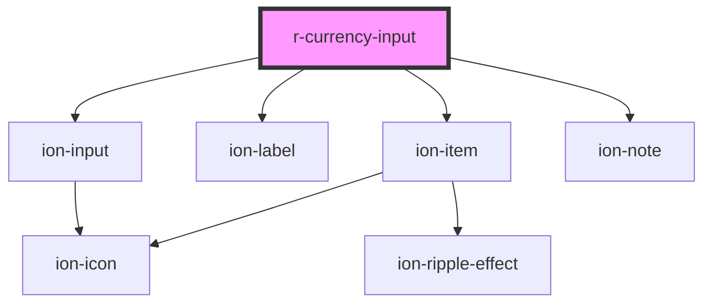

# r-currency-input

<!-- Auto Generated Below -->

## Properties

| Property             | Attribute              | Description                                                                                                                                                                                                            | Type                                                                                                            | Default     |
| -------------------- | ---------------------- | ---------------------------------------------------------------------------------------------------------------------------------------------------------------------------------------------------------------------- | --------------------------------------------------------------------------------------------------------------- | ----------- |
| `allowDecimals`      | `allow-decimals`       | If true, allows decimal values (default: true)                                                                                                                                                                         | `boolean`                                                                                                       | `true`      |
| `allowNegativeValue` | `allow-negative-value` | If true, allows negative values (default: true)                                                                                                                                                                        | `boolean`                                                                                                       | `true`      |
| `color`              | `color`                | The currency input color (Ionic color)                                                                                                                                                                                 | `"danger" \| "dark" \| "light" \| "medium" \| "primary" \| "secondary" \| "success" \| "tertiary" \| "warning"` | `undefined` |
| `currencyCode`       | `currency-code`        | ISO currency code (e.g., "USD", "EUR", "GBP")                                                                                                                                                                          | `string`                                                                                                        | `'USD'`     |
| `decimalSeparator`   | `decimal-separator`    | Character used as decimal separator (default: based on locale)                                                                                                                                                         | `string`                                                                                                        | `undefined` |
| `disabled`           | `disabled`             | If true, the currency input is disabled                                                                                                                                                                                | `boolean`                                                                                                       | `false`     |
| `error`              | `error`                | If true, the currency input has error state                                                                                                                                                                            | `boolean`                                                                                                       | `false`     |
| `errorText`          | `error-text`           | Error message to display                                                                                                                                                                                               | `string`                                                                                                        | `undefined` |
| `fill`               | `fill`                 | The fill style                                                                                                                                                                                                         | `"clear" \| "default" \| "outline" \| "solid"`                                                                  | `undefined` |
| `fixedDecimalLength` | `fixed-decimal-length` | If true, ensures the value always has a fixed number of decimal places                                                                                                                                                 | `boolean`                                                                                                       | `false`     |
| `groupSeparator`     | `group-separator`      | Character used as thousands/group separator (default: based on locale)                                                                                                                                                 | `string`                                                                                                        | `undefined` |
| `helperText`         | `helper-text`          | Helper text to display                                                                                                                                                                                                 | `string`                                                                                                        | `undefined` |
| `label`              | `label`                | The currency input label                                                                                                                                                                                               | `string`                                                                                                        | `undefined` |
| `locale`             | `locale`               | Locale for formatting (e.g., "en-US", "en-GB")                                                                                                                                                                         | `string`                                                                                                        | `undefined` |
| `max`                | `max`                  | Maximum value                                                                                                                                                                                                          | `number`                                                                                                        | `undefined` |
| `min`                | `min`                  | Minimum value                                                                                                                                                                                                          | `number`                                                                                                        | `undefined` |
| `name`               | `name`                 | The currency input name (for form submission)                                                                                                                                                                          | `string`                                                                                                        | `undefined` |
| `placeholder`        | `placeholder`          | Placeholder text                                                                                                                                                                                                       | `string`                                                                                                        | `undefined` |
| `precision`          | `precision`            | Number of decimal places (default: 2) Set to 0 for currencies without decimals (e.g., JPY) Set to higher values for more precision (e.g., 3 for some cryptocurrencies) The input will enforce this limit during typing | `number`                                                                                                        | `2`         |
| `readonly`           | `readonly`             | If true, the currency input is readonly                                                                                                                                                                                | `boolean`                                                                                                       | `false`     |
| `required`           | `required`             | If true, the currency input is required                                                                                                                                                                                | `boolean`                                                                                                       | `false`     |
| `shape`              | `shape`                | The shape                                                                                                                                                                                                              | `"round"`                                                                                                       | `undefined` |
| `turnOffSeparators`  | `turn-off-separators`  | If true, disables automatic insertion of group separators                                                                                                                                                              | `boolean`                                                                                                       | `false`     |
| `value`              | `value`                | The currency value (number)                                                                                                                                                                                            | `number`                                                                                                        | `undefined` |

## Events

| Event     | Description                                                      | Type                               |
| --------- | ---------------------------------------------------------------- | ---------------------------------- |
| `rBlur`   | Emitted when the currency input loses focus                      | `CustomEvent<FocusEvent>`          |
| `rChange` | Emitted when the currency input value changes (alias for rInput) | `CustomEvent<CustomEvent<number>>` |
| `rFocus`  | Emitted when the currency input receives focus                   | `CustomEvent<FocusEvent>`          |
| `rInput`  | Emitted when the currency input value changes                    | `CustomEvent<CustomEvent<number>>` |

## Dependencies

### Depends on

- ion-item
- ion-label
- ion-input
- ion-note

### Graph

----------------------------------------------

*Built with [StencilJS](https://stenciljs.com/)*
