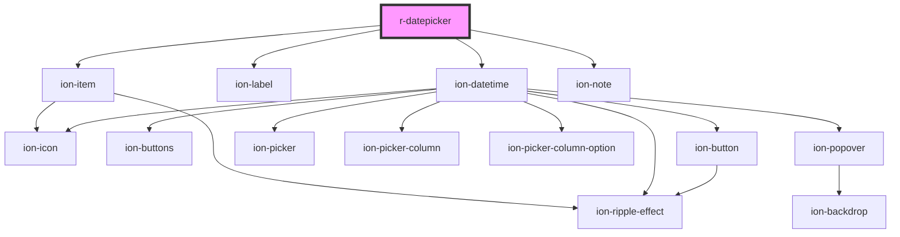

# r-datepicker

<!-- Auto Generated Below -->

## Properties

| Property       | Attribute      | Description                                | Type                                                                                                            | Default     |
| -------------- | -------------- | ------------------------------------------ | --------------------------------------------------------------------------------------------------------------- | ----------- |
| `color`        | `color`        | The datepicker color (Ionic color)         | `"danger" \| "dark" \| "light" \| "medium" \| "primary" \| "secondary" \| "success" \| "tertiary" \| "warning"` | `undefined` |
| `disabled`     | `disabled`     | If true, the datepicker is disabled        | `boolean`                                                                                                       | `false`     |
| `error`        | `error`        | If true, the datepicker has error state    | `boolean`                                                                                                       | `false`     |
| `errorText`    | `error-text`   | Error message to display                   | `string`                                                                                                        | `undefined` |
| `fill`         | `fill`         | The datepicker fill style                  | `"clear" \| "default" \| "outline" \| "solid"`                                                                  | `undefined` |
| `helperText`   | `helper-text`  | Helper text to display                     | `string`                                                                                                        | `undefined` |
| `label`        | `label`        | The datepicker label                       | `string`                                                                                                        | `undefined` |
| `max`          | `max`          | Maximum date (ISO string)                  | `string`                                                                                                        | `undefined` |
| `min`          | `min`          | Minimum date (ISO string)                  | `string`                                                                                                        | `undefined` |
| `multiple`     | `multiple`     | If true, shows multiple date selection     | `boolean`                                                                                                       | `undefined` |
| `name`         | `name`         | The datepicker name                        | `string`                                                                                                        | `undefined` |
| `placeholder`  | `placeholder`  | The datepicker placeholder                 | `string`                                                                                                        | `undefined` |
| `preferWheel`  | `prefer-wheel` | Preferred format for display               | `boolean`                                                                                                       | `undefined` |
| `presentation` | `presentation` | Presentation style (date, time, date-time) | `"date" \| "date-time" \| "month" \| "month-year" \| "time" \| "time-date" \| "year"`                           | `undefined` |
| `required`     | `required`     | If true, the datepicker is required        | `boolean`                                                                                                       | `false`     |
| `shape`        | `shape`        | The datepicker shape                       | `"round"`                                                                                                       | `undefined` |
| `value`        | `value`        | The datepicker value (ISO string format)   | `string`                                                                                                        | `undefined` |

## Events

| Event     | Description                               | Type                            |
| --------- | ----------------------------------------- | ------------------------------- |
| `rBlur`   | Emitted when the datepicker is blurred    | `CustomEvent<CustomEvent<any>>` |
| `rChange` | Emitted when the datepicker value changes | `CustomEvent<CustomEvent<any>>` |
| `rFocus`  | Emitted when the datepicker is focused    | `CustomEvent<CustomEvent<any>>` |

## Dependencies

### Depends on

- ion-item
- ion-label
- ion-datetime
- ion-note

### Graph

----------------------------------------------

*Built with [StencilJS](https://stenciljs.com/)*
