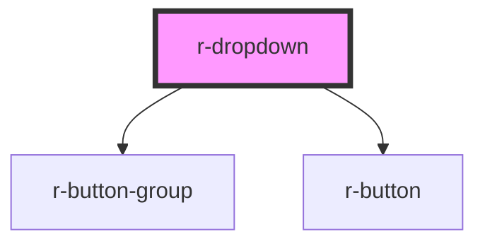

# r-dropdown

<!-- Auto Generated Below -->

## Properties

| Property      | Attribute       | Description                  | Type                                                                              | Default     |
| ------------- | --------------- | ---------------------------- | --------------------------------------------------------------------------------- | ----------- |
| `disabled`    | `disabled`      | Whether dropdown is disabled | `boolean`                                                                         | `false`     |
| `hideOnClick` | `hide-on-click` | Whether to hide on click     | `boolean`                                                                         | `true`      |
| `hideTimeout` | `hide-timeout`  | Hide timeout (ms)            | `number`                                                                          | `150`       |
| `maxHeight`   | `max-height`    | Max height of dropdown menu  | `string`                                                                          | `undefined` |
| `placement`   | `placement`     | Dropdown placement           | `"bottom" \| "bottom-end" \| "bottom-start" \| "top" \| "top-end" \| "top-start"` | `'bottom'`  |
| `showTimeout` | `show-timeout`  | Show timeout (ms)            | `number`                                                                          | `150`       |
| `size`        | `size`          | Button size for split button | `"default" \| "large" \| "small"`                                                 | `'default'` |
| `splitButton` | `split-button`  | Split button mode            | `boolean`                                                                         | `false`     |
| `trigger`     | `trigger`       | Trigger mode                 | `"click" \| "contextmenu" \| "hover"`                                             | `'hover'`   |
| `type`        | `type`          | Button type for split button | `"danger" \| "default" \| "info" \| "primary" \| "success" \| "warning"`          | `'default'` |

## Events

| Event           | Description | Type                            |
| --------------- | ----------- | ------------------------------- |
| `click`         |             | `CustomEvent<MouseEvent>`       |
| `command`       |             | `CustomEvent<number \| string>` |
| `visibleChange` |             | `CustomEvent<boolean>`          |

## Methods

### `hide() => Promise<void>`

Hide dropdown

#### Returns

Type: `Promise<void>`

### `show() => Promise<void>`

Show dropdown

#### Returns

Type: `Promise<void>`

## Dependencies

### Depends on

- [r-button-group](../r-button-group)
- [r-button](../r-button)

### Graph

----------------------------------------------

*Built with [StencilJS](https://stenciljs.com/)*
