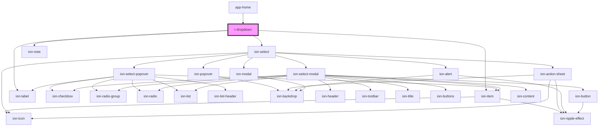

# r-dropdown

<!-- Auto Generated Below -->

## Properties

| Property      | Attribute     | Description                                    | Type                                     | Default     |
| ------------- | ------------- | ---------------------------------------------- | ---------------------------------------- | ----------- |
| `cancelable`  | `cancelable`  | If true, the interface is cancelable           | `boolean`                                | `true`      |
| `color`       | `color`       | The dropdown color (Ionic color)               | `string`                                 | `undefined` |
| `disabled`    | `disabled`    | If true, the dropdown is disabled              | `boolean`                                | `false`     |
| `error`       | `error`       | If true, the dropdown has error state          | `boolean`                                | `false`     |
| `errorText`   | `error-text`  | Error message to display                       | `string`                                 | `undefined` |
| `fill`        | `fill`        | The dropdown fill style                        | `"outline" \| "solid"`                   | `undefined` |
| `helperText`  | `helper-text` | Helper text to display                         | `string`                                 | `undefined` |
| `interface`   | `interface`   | Interface style (action-sheet, popover, alert) | `"action-sheet" \| "alert" \| "popover"` | `undefined` |
| `label`       | `label`       | The dropdown label                             | `string`                                 | `undefined` |
| `multiple`    | `multiple`    | If true, allows multiple selections            | `boolean`                                | `false`     |
| `name`        | `name`        | The dropdown name                              | `string`                                 | `undefined` |
| `placeholder` | `placeholder` | The dropdown placeholder                       | `string`                                 | `undefined` |
| `required`    | `required`    | If true, the dropdown is required              | `boolean`                                | `false`     |
| `shape`       | `shape`       | The dropdown shape                             | `"round"`                                | `undefined` |
| `value`       | `value`       | The dropdown value                             | `number \| string`                       | `undefined` |

## Events

| Event     | Description                             | Type                            |
| --------- | --------------------------------------- | ------------------------------- |
| `rBlur`   | Emitted when the dropdown is blurred    | `CustomEvent<CustomEvent<any>>` |
| `rChange` | Emitted when the dropdown value changes | `CustomEvent<CustomEvent<any>>` |
| `rFocus`  | Emitted when the dropdown is focused    | `CustomEvent<CustomEvent<any>>` |

## Dependencies

### Used by

 - [app-home](../app-home)

### Depends on

- ion-item
- ion-label
- ion-select
- ion-note

### Graph

----------------------------------------------

*Built with [StencilJS](https://stenciljs.com/)*
