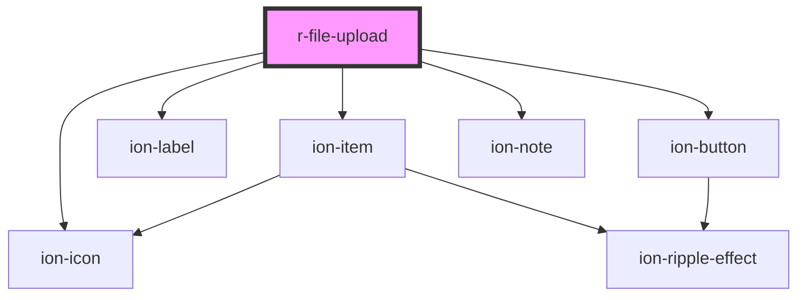

# r-file-upload

<!-- Auto Generated Below -->

## Properties

| Property      | Attribute      | Description                                  | Type                                                                                                            | Default     |
| ------------- | -------------- | -------------------------------------------- | --------------------------------------------------------------------------------------------------------------- | ----------- |
| `accept`      | `accept`       | Accepted file types (e.g., ".pdf,.png,.jpg") | `string`                                                                                                        | `undefined` |
| `color`       | `color`        | The file upload color (Ionic color)          | `"danger" \| "dark" \| "light" \| "medium" \| "primary" \| "secondary" \| "success" \| "tertiary" \| "warning"` | `undefined` |
| `disabled`    | `disabled`     | If true, the file upload is disabled         | `boolean`                                                                                                       | `false`     |
| `dragDrop`    | `drag-drop`    | If true, shows drag and drop area            | `boolean`                                                                                                       | `true`      |
| `error`       | `error`        | If true, the file upload has error state     | `boolean`                                                                                                       | `false`     |
| `errorText`   | `error-text`   | Error message to display                     | `string`                                                                                                        | `undefined` |
| `fill`        | `fill`         | The fill style                               | `"outline" \| "solid"`                                                                                          | `undefined` |
| `helperText`  | `helper-text`  | Helper text to display                       | `string`                                                                                                        | `undefined` |
| `label`       | `label`        | The file upload label                        | `string`                                                                                                        | `undefined` |
| `maxSize`     | `max-size`     | Maximum file size in bytes                   | `number`                                                                                                        | `undefined` |
| `multiple`    | `multiple`     | If true, allows multiple file selection      | `boolean`                                                                                                       | `false`     |
| `name`        | `name`         | The file upload name (for form submission)   | `string`                                                                                                        | `undefined` |
| `required`    | `required`     | If true, the file upload is required         | `boolean`                                                                                                       | `false`     |
| `showPreview` | `show-preview` | If true, shows file preview                  | `boolean`                                                                                                       | `true`      |

## Events

| Event           | Description                       | Type                               |
| --------------- | --------------------------------- | ---------------------------------- |
| `rFileError`    | Emitted when there's a file error | `CustomEvent<CustomEvent<string>>` |
| `rFileRemoved`  | Emitted when a file is removed    | `CustomEvent<CustomEvent<File>>`   |
| `rFileSelected` | Emitted when files are selected   | `CustomEvent<CustomEvent<File[]>>` |

## Dependencies

### Depends on

- ion-item
- ion-label
- ion-icon
- ion-button
- ion-note

### Graph

----------------------------------------------

*Built with [StencilJS](https://stenciljs.com/)*
