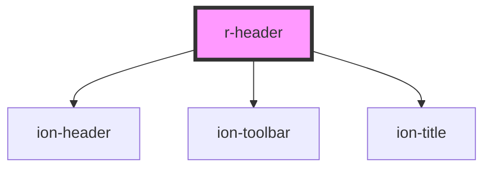

# r-header

Header component that wraps Ionic header with toolbar and title support. Provides a consistent header structure for applications.

## Usage

### Basic Header

```html
<r-header header-title="My App"></r-header>
```

### Header with Buttons

You can add **as many buttons as you want** in the `start` and `end` slots. Each slot can contain multiple `ion-button` elements inside an `ion-buttons` container.

```html
<r-header title="My App">
  <ion-buttons slot="start">
    <ion-button>
      <ion-icon slot="icon-only" name="menu-outline"></ion-icon>
    </ion-button>
  </ion-buttons>
  <ion-buttons slot="end">
    <ion-button>
      <ion-icon slot="icon-only" name="search-outline"></ion-icon>
    </ion-button>
    <ion-button>
      <ion-icon slot="icon-only" name="more-outline"></ion-icon>
    </ion-button>
  </ion-buttons>
</r-header>
```

### Header with Multiple Buttons

You can add multiple buttons in each slot - there's no limit:

```html
<r-header title="My App">
  <ion-buttons slot="start">
    <ion-button>
      <ion-icon slot="icon-only" name="arrow-back-outline"></ion-icon>
    </ion-button>
    <ion-button>
      <ion-icon slot="icon-only" name="menu-outline"></ion-icon>
    </ion-button>
  </ion-buttons>
  <ion-buttons slot="end">
    <ion-button>
      <ion-icon slot="icon-only" name="search-outline"></ion-icon>
    </ion-button>
    <ion-button>
      <ion-icon slot="icon-only" name="notifications-outline"></ion-icon>
    </ion-button>
    <ion-button>
      <ion-icon slot="icon-only" name="settings-outline"></ion-icon>
    </ion-button>
    <ion-button>
      <ion-icon slot="icon-only" name="more-outline"></ion-icon>
    </ion-button>
  </ion-buttons>
</r-header>
```

### Translucent Header

```html
<r-header title="My App" translucent></r-header>
```

<!-- Auto Generated Below -->


## Properties

| Property      | Attribute      | Description                             | Type                                                                                                            | Default     |
| ------------- | -------------- | --------------------------------------- | --------------------------------------------------------------------------------------------------------------- | ----------- |
| `collapse`    | `collapse`     | If true, the header collapses on scroll | `"condense" \| "fade"`                                                                                          | `undefined` |
| `color`       | `color`        | The header color (Ionic color)          | `"danger" \| "dark" \| "light" \| "medium" \| "primary" \| "secondary" \| "success" \| "tertiary" \| "warning"` | `undefined` |
| `headerTitle` | `header-title` | The header title text                   | `string`                                                                                                        | `undefined` |
| `mode`        | `mode`         | The header mode (ios or md)             | `"ios" \| "md"`                                                                                                 | `undefined` |
| `noBorder`    | `no-border`    | If true, the header has a border        | `boolean`                                                                                                       | `false`     |
| `translucent` | `translucent`  | If true, the header is translucent      | `boolean`                                                                                                       | `false`     |


## Dependencies

### Depends on

- ion-header
- ion-toolbar
- ion-title

### Graph


----------------------------------------------

*Built with [StencilJS](https://stenciljs.com/)*
