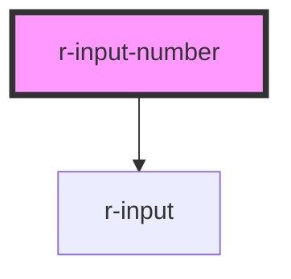

# r-input-number

<!-- Auto Generated Below -->

## Properties

| Property           | Attribute           | Description                                      | Type                              | Default                   |
| ------------------ | ------------------- | ------------------------------------------------ | --------------------------------- | ------------------------- |
| `ariaLabel`        | `aria-label`        | Aria label                                       | `string`                          | `undefined`               |
| `controls`         | `controls`          | Whether to enable control buttons                | `boolean`                         | `true`                    |
| `controlsPosition` | `controls-position` | Position of control buttons                      | `"" \| "right"`                   | `''`                      |
| `disabled`         | `disabled`          | Whether the component is disabled                | `boolean`                         | `false`                   |
| `inputName`        | `name`              | Name attribute                                   | `string`                          | `undefined`               |
| `max`              | `max`               | Maximum allowed value                            | `number`                          | `Number.MAX_SAFE_INTEGER` |
| `min`              | `min`               | Minimum allowed value                            | `number`                          | `Number.MIN_SAFE_INTEGER` |
| `placeholder`      | `placeholder`       | Placeholder text                                 | `string`                          | `''`                      |
| `precision`        | `precision`         | Precision of input value                         | `number`                          | `undefined`               |
| `readonly`         | `readonly`          | Whether the component is readonly                | `boolean`                         | `false`                   |
| `size`             | `size`              | Size of the component                            | `"default" \| "large" \| "small"` | `'default'`               |
| `step`             | `step`              | Incremental step                                 | `number`                          | `1`                       |
| `stepStrictly`     | `step-strictly`     | Whether input value can only be multiple of step | `boolean`                         | `false`                   |
| `value`            | `value`             | Binding value                                    | `number`                          | `null`                    |

## Events

| Event    | Description | Type                  |
| -------- | ----------- | --------------------- |
| `change` |             | `CustomEvent<number>` |

## Methods

### `setBlur() => Promise<void>`

Blur the input

#### Returns

Type: `Promise<void>`

### `setFocus() => Promise<void>`

Focus the input

#### Returns

Type: `Promise<void>`

## Dependencies

### Depends on

- [r-input](../r-input)

### Graph

----------------------------------------------

*Built with [StencilJS](https://stenciljs.com/)*
