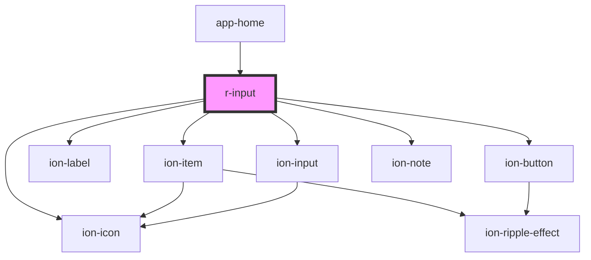

# r-input

<!-- Auto Generated Below -->

## Properties

| Property             | Attribute              | Description                                                            | Type                   | Default     |
| -------------------- | ---------------------- | ---------------------------------------------------------------------- | ---------------------- | ----------- |
| `autocomplete`       | `autocomplete`         | The input autocomplete attribute                                       | `string`               | `undefined` |
| `clearOnEdit`        | `clear-on-edit`        | If true, clears the input on edit                                      | `boolean`              | `undefined` |
| `color`              | `color`                | The input color (Ionic color)                                          | `string`               | `undefined` |
| `disabled`           | `disabled`             | If true, the input is disabled                                         | `boolean`              | `false`     |
| `error`              | `error`                | If true, the input has error state                                     | `boolean`              | `false`     |
| `errorText`          | `error-text`           | Error message to display                                               | `string`               | `undefined` |
| `fill`               | `fill`                 | The input fill style                                                   | `"outline" \| "solid"` | `undefined` |
| `helperText`         | `helper-text`          | Helper text to display                                                 | `string`               | `undefined` |
| `label`              | `label`                | The input label                                                        | `string`               | `undefined` |
| `maxlength`          | `maxlength`            | Maximum length of the input                                            | `number`               | `undefined` |
| `minlength`          | `minlength`            | Minimum length of the input                                            | `number`               | `undefined` |
| `name`               | `name`                 | The input name                                                         | `string`               | `undefined` |
| `pattern`            | `pattern`              | Pattern for validation                                                 | `string`               | `undefined` |
| `placeholder`        | `placeholder`          | The input placeholder                                                  | `string`               | `undefined` |
| `readonly`           | `readonly`             | If true, the input is readonly                                         | `boolean`              | `false`     |
| `required`           | `required`             | If true, the input is required                                         | `boolean`              | `false`     |
| `shape`              | `shape`                | The input shape                                                        | `"round"`              | `undefined` |
| `showPasswordToggle` | `show-password-toggle` | If true, shows password toggle button (only for password type)         | `boolean`              | `true`      |
| `type`               | `type`                 | The input type (text, password, email, number, tel, url, search, etc.) | `string`               | `'text'`    |
| `value`              | `value`                | The input value                                                        | `string`               | `undefined` |

## Events

| Event    | Description                          | Type                            |
| -------- | ------------------------------------ | ------------------------------- |
| `rBlur`  | Emitted when the input is blurred    | `CustomEvent<FocusEvent>`       |
| `rFocus` | Emitted when the input is focused    | `CustomEvent<FocusEvent>`       |
| `rInput` | Emitted when the input value changes | `CustomEvent<CustomEvent<any>>` |

## Dependencies

### Used by

 - [app-home](../app-home)

### Depends on

- ion-item
- ion-label
- ion-input
- ion-button
- ion-icon
- ion-note

### Graph

----------------------------------------------

*Built with [StencilJS](https://stenciljs.com/)*
