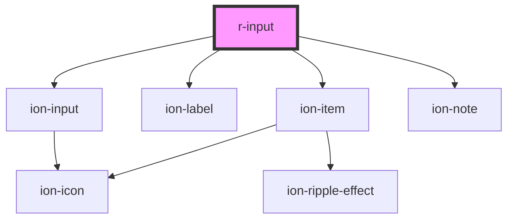

# r-input

<!-- Auto Generated Below -->

## Properties

| Property       | Attribute       | Description | Type                                                                                                            | Default     |
| -------------- | --------------- | ----------- | --------------------------------------------------------------------------------------------------------------- | ----------- |
| `autocomplete` | `autocomplete`  |             | `string`                                                                                                        | `undefined` |
| `clearOnEdit`  | `clear-on-edit` |             | `boolean`                                                                                                       | `undefined` |
| `color`        | `color`         |             | `"danger" \| "dark" \| "light" \| "medium" \| "primary" \| "secondary" \| "success" \| "tertiary" \| "warning"` | `undefined` |
| `disabled`     | `disabled`      |             | `boolean`                                                                                                       | `false`     |
| `error`        | `error`         |             | `boolean`                                                                                                       | `false`     |
| `errorText`    | `error-text`    |             | `string`                                                                                                        | `undefined` |
| `fill`         | `fill`          |             | `"clear" \| "default" \| "outline" \| "solid"`                                                                  | `undefined` |
| `helperText`   | `helper-text`   |             | `string`                                                                                                        | `undefined` |
| `label`        | `label`         |             | `string`                                                                                                        | `undefined` |
| `maxlength`    | `maxlength`     |             | `number`                                                                                                        | `undefined` |
| `minlength`    | `minlength`     |             | `number`                                                                                                        | `undefined` |
| `name`         | `name`          |             | `string`                                                                                                        | `undefined` |
| `pattern`      | `pattern`       |             | `string`                                                                                                        | `undefined` |
| `placeholder`  | `placeholder`   |             | `string`                                                                                                        | `undefined` |
| `readonly`     | `readonly`      |             | `boolean`                                                                                                       | `false`     |
| `required`     | `required`      |             | `boolean`                                                                                                       | `false`     |
| `shape`        | `shape`         |             | `"round"`                                                                                                       | `undefined` |
| `type`         | `type`          |             | `string`                                                                                                        | `'text'`    |
| `value`        | `value`         |             | `string`                                                                                                        | `undefined` |

## Events

| Event    | Description | Type                            |
| -------- | ----------- | ------------------------------- |
| `rBlur`  |             | `CustomEvent<FocusEvent>`       |
| `rFocus` |             | `CustomEvent<FocusEvent>`       |
| `rInput` |             | `CustomEvent<CustomEvent<any>>` |

## Dependencies

### Depends on

- ion-item
- ion-label
- ion-input
- ion-note

### Graph

----------------------------------------------

*Built with [StencilJS](https://stenciljs.com/)*
