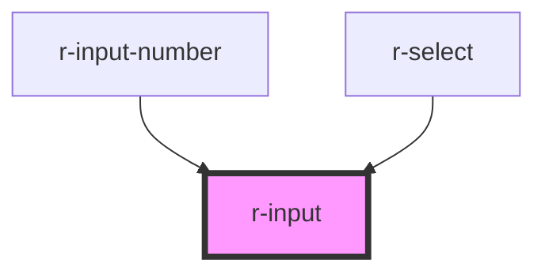

# r-input

<!-- Auto Generated Below -->

## Properties

| Property        | Attribute         | Description                     | Type                                                                          | Default      |
| --------------- | ----------------- | ------------------------------- | ----------------------------------------------------------------------------- | ------------ |
| `ariaLabel`     | `aria-label`      | Aria label                      | `string`                                                                      | `undefined`  |
| `autocomplete`  | `autocomplete`    | Native autocomplete             | `string`                                                                      | `'off'`      |
| `autofocus`     | `autofocus`       | Native autofocus                | `boolean`                                                                     | `false`      |
| `autosize`      | `autosize`        | Autosize for textarea           | `boolean \| { minRows?: number; maxRows?: number; }`                          | `false`      |
| `clearable`     | `clearable`       | Whether to show clear button    | `boolean`                                                                     | `false`      |
| `disabled`      | `disabled`        | Whether input is disabled       | `boolean`                                                                     | `false`      |
| `inputName`     | `name`            | Native name                     | `string`                                                                      | `undefined`  |
| `inputTabindex` | `input-tabindex`  | Tab index                       | `number \| string`                                                            | `undefined`  |
| `maxlength`     | `maxlength`       | Max length                      | `number`                                                                      | `undefined`  |
| `minlength`     | `minlength`       | Min length                      | `number`                                                                      | `undefined`  |
| `placeholder`   | `placeholder`     | Placeholder text                | `string`                                                                      | `''`         |
| `prefixIcon`    | `prefix-icon`     | Prefix icon (emoji or text)     | `string`                                                                      | `undefined`  |
| `readonly`      | `readonly`        | Whether input is readonly       | `boolean`                                                                     | `false`      |
| `resize`        | `resize`          | Textarea resize behavior        | `"both" \| "horizontal" \| "none" \| "vertical"`                              | `'vertical'` |
| `rows`          | `rows`            | Number of rows for textarea     | `number`                                                                      | `2`          |
| `showPassword`  | `show-password`   | Whether to show password toggle | `boolean`                                                                     | `false`      |
| `showWordLimit` | `show-word-limit` | Show word count                 | `boolean`                                                                     | `false`      |
| `size`          | `size`            | Size of input                   | `"default" \| "large" \| "small"`                                             | `'default'`  |
| `suffixIcon`    | `suffix-icon`     | Suffix icon (emoji or text)     | `string`                                                                      | `undefined`  |
| `type`          | `type`            | Type of input                   | `"email" \| "number" \| "password" \| "tel" \| "text" \| "textarea" \| "url"` | `'text'`     |
| `value`         | `value`           | Binding value                   | `number \| string`                                                            | `''`         |

## Events

| Event     | Description | Type                |
| --------- | ----------- | ------------------- |
| `cleared` |             | `CustomEvent<void>` |

## Methods

### `clear() => Promise<void>`

Clear the input

#### Returns

Type: `Promise<void>`

### `select() => Promise<void>`

Select text in input

#### Returns

Type: `Promise<void>`

### `setBlur() => Promise<void>`

Blur the input

#### Returns

Type: `Promise<void>`

### `setFocus() => Promise<void>`

Focus the input

#### Returns

Type: `Promise<void>`

## Dependencies

### Used by

 - [r-input-number](../r-input-number)
 - [r-select](../r-select)

### Graph

----------------------------------------------

*Built with [StencilJS](https://stenciljs.com/)*
