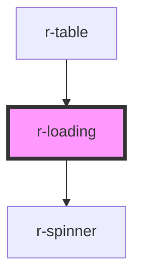

# r-loading

<!-- Auto Generated Below -->

## Properties

| Property           | Attribute           | Description                 | Type                              | Default     |
| ------------------ | ------------------- | --------------------------- | --------------------------------- | ----------- |
| `background`       | `background`        | Background style            | `"dark" \| "light"`               | `'light'`   |
| `customBackground` | `custom-background` | Custom background color     | `string`                          | `undefined` |
| `fullscreen`       | `fullscreen`        | Whether to show fullscreen  | `boolean`                         | `false`     |
| `loading`          | `loading`           | Whether loading is visible  | `boolean`                         | `false`     |
| `lock`             | `lock`              | Whether to lock body scroll | `boolean`                         | `true`      |
| `spinnerSize`      | `spinner-size`      | Spinner size                | `"default" \| "large" \| "small"` | `'default'` |
| `text`             | `text`              | Loading text                | `string`                          | `undefined` |

## Dependencies

### Used by

 - [r-table](../r-table)

### Depends on

- [r-spinner](../r-spinner)

### Graph

----------------------------------------------

*Built with [StencilJS](https://stenciljs.com/)*
