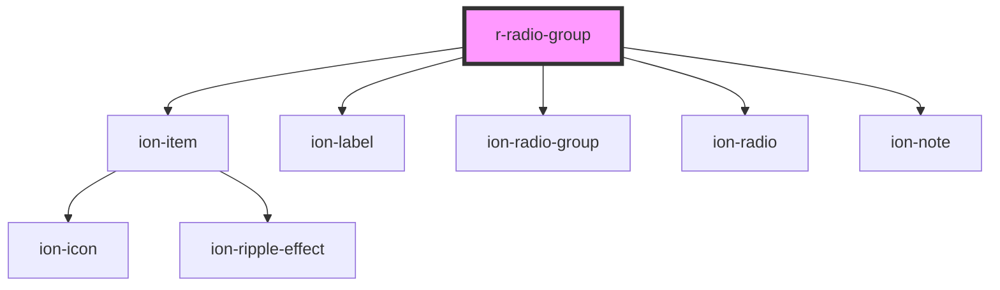

# r-radio-group

<!-- Auto Generated Below -->

## Properties

| Property              | Attribute               | Description                                                     | Type                                                                                                            | Default     |
| --------------------- | ----------------------- | --------------------------------------------------------------- | --------------------------------------------------------------------------------------------------------------- | ----------- |
| `alignment`           | `alignment`             | Controls the alignment of the radio and label on the cross axis | `"center" \| "start"`                                                                                           | `undefined` |
| `allowEmptySelection` | `allow-empty-selection` | If true, allows deselecting the selected option                 | `boolean`                                                                                                       | `false`     |
| `color`               | `color`                 | The radio group color (Ionic color)                             | `"danger" \| "dark" \| "light" \| "medium" \| "primary" \| "secondary" \| "success" \| "tertiary" \| "warning"` | `undefined` |
| `disabled`            | `disabled`              | If true, the radio group is disabled                            | `boolean`                                                                                                       | `false`     |
| `error`               | `error`                 | If true, the radio group has error state                        | `boolean`                                                                                                       | `false`     |
| `errorText`           | `error-text`            | Error message to display                                        | `string`                                                                                                        | `undefined` |
| `fill`                | `fill`                  | The fill style                                                  | `"clear" \| "default" \| "outline" \| "solid"`                                                                  | `undefined` |
| `helperText`          | `helper-text`           | Helper text to display                                          | `string`                                                                                                        | `undefined` |
| `justify`             | `justify`               | Determines how the label and radio are packed within a line     | `"end" \| "space-between" \| "start"`                                                                           | `undefined` |
| `label`               | `label`                 | The radio group label                                           | `string`                                                                                                        | `undefined` |
| `labelPlacement`      | `label-placement`       | Specifies the label's position relative to the radio            | `"end" \| "fixed" \| "stacked" \| "start"`                                                                      | `undefined` |
| `mode`                | `mode`                  | Chooses the platform styles to use                              | `"ios" \| "md"`                                                                                                 | `undefined` |
| `name`                | `name`                  | The radio group name (for form submission)                      | `string`                                                                                                        | `undefined` |
| `options`             | `options`               | Radio options (array of { value: string, label: string })       | `string \| { value: string; label: string; }[]`                                                                 | `undefined` |
| `required`            | `required`              | If true, the radio group is required                            | `boolean`                                                                                                       | `false`     |
| `value`               | `value`                 | The selected value                                              | `string`                                                                                                        | `undefined` |

## Events

| Event     | Description | Type                            |
| --------- | ----------- | ------------------------------- |
| `rBlur`   |             | `CustomEvent<CustomEvent<any>>` |
| `rChange` |             | `CustomEvent<CustomEvent<any>>` |
| `rFocus`  |             | `CustomEvent<CustomEvent<any>>` |

## Dependencies

### Depends on

- ion-item
- ion-label
- ion-radio-group
- ion-radio
- ion-note

### Graph

----------------------------------------------

*Built with [StencilJS](https://stenciljs.com/)*
