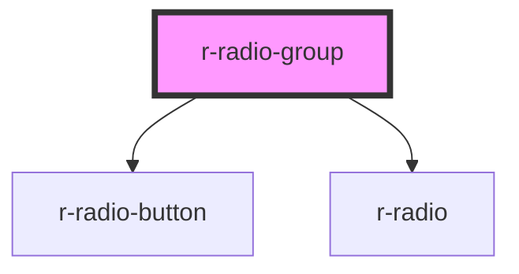

# r-radio-group

<!-- Auto Generated Below -->

## Properties

| Property        | Attribute        | Description                                            | Type                              | Default     |
| --------------- | ---------------- | ------------------------------------------------------ | --------------------------------- | ----------- |
| `ariaLabel`     | `aria-label`     | Aria label                                             | `string`                          | `undefined` |
| `disabled`      | `disabled`       | Whether the nesting radios are disabled                | `boolean`                         | `false`     |
| `fill`          | `fill`           | Border and background color when button is active      | `string`                          | `undefined` |
| `inputName`     | `name`           | Native name attribute                                  | `string`                          | `undefined` |
| `options`       | --               | Options data for quick setup                           | `RadioOption[]`                   | `[]`        |
| `size`          | `size`           | Size of radio buttons                                  | `"default" \| "large" \| "small"` | `'default'` |
| `textColor`     | `text-color`     | Font color when button is active                       | `string`                          | `'#ffffff'` |
| `type`          | `type`           | Component type to render options ('radio' or 'button') | `"button" \| "radio"`             | `'radio'`   |
| `validateEvent` | `validate-event` | Whether to trigger form validation                     | `boolean`                         | `true`      |
| `value`         | `value`          | Binding value                                          | `boolean \| number \| string`     | `undefined` |
| `vertical`      | `vertical`       | Vertical layout                                        | `boolean`                         | `false`     |

## Events

| Event    | Description | Type                                       |
| -------- | ----------- | ------------------------------------------ |
| `change` |             | `CustomEvent<boolean \| number \| string>` |

## Dependencies

### Depends on

- [r-radio-button](../r-radio-button)
- [r-radio](../r-radio)

### Graph

----------------------------------------------

*Built with [StencilJS](https://stenciljs.com/)*
