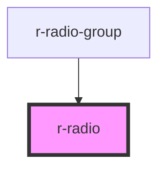

# r-radio

<!-- Auto Generated Below -->

## Properties

| Property    | Attribute  | Description                                              | Type                              | Default     |
| ----------- | ---------- | -------------------------------------------------------- | --------------------------------- | ----------- |
| `border`    | `border`   | Whether to add a border around the radio                 | `boolean`                         | `false`     |
| `checked`   | `checked`  | Whether the radio is checked (controlled by radio-group) | `boolean`                         | `false`     |
| `disabled`  | `disabled` | Whether the radio is disabled                            | `boolean`                         | `false`     |
| `inputName` | `name`     | Native name attribute                                    | `string`                          | `undefined` |
| `label`     | `label`    | The label text (display text)                            | `string`                          | `undefined` |
| `size`      | `size`     | Size of the radio                                        | `"default" \| "large" \| "small"` | `'default'` |
| `value`     | `value`    | The value of the radio                                   | `boolean \| number \| string`     | `undefined` |

## Events

| Event    | Description | Type                                       |
| -------- | ----------- | ------------------------------------------ |
| `change` |             | `CustomEvent<boolean \| number \| string>` |

## Dependencies

### Used by

 - [r-radio-group](../r-radio-group)

### Graph

----------------------------------------------

*Built with [StencilJS](https://stenciljs.com/)*
