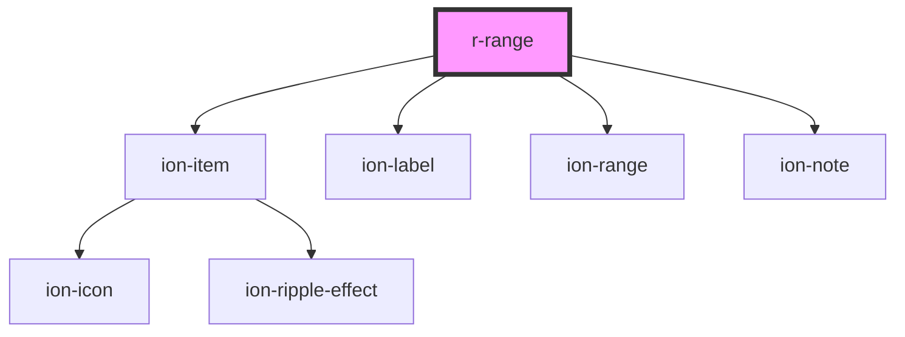

# r-range

<!-- Auto Generated Below -->

## Properties

| Property     | Attribute     | Description                                                                               | Type                                                                                                            | Default     |
| ------------ | ------------- | ----------------------------------------------------------------------------------------- | --------------------------------------------------------------------------------------------------------------- | ----------- |
| `color`      | `color`       | The range color (Ionic color)                                                             | `"danger" \| "dark" \| "light" \| "medium" \| "primary" \| "secondary" \| "success" \| "tertiary" \| "warning"` | `undefined` |
| `disabled`   | `disabled`    | If true, the range is disabled                                                            | `boolean`                                                                                                       | `false`     |
| `dualKnobs`  | `dual-knobs`  | If true, shows two knobs for range selection                                              | `boolean`                                                                                                       | `false`     |
| `error`      | `error`       | If true, the range has error state                                                        | `boolean`                                                                                                       | `false`     |
| `errorText`  | `error-text`  | Error message to display                                                                  | `string`                                                                                                        | `undefined` |
| `fill`       | `fill`        | The fill style                                                                            | `"outline" \| "solid"`                                                                                          | `undefined` |
| `helperText` | `helper-text` | Helper text to display                                                                    | `string`                                                                                                        | `undefined` |
| `label`      | `label`       | The range label                                                                           | `string`                                                                                                        | `undefined` |
| `max`        | `max`         | Maximum value                                                                             | `number`                                                                                                        | `100`       |
| `min`        | `min`         | Minimum value                                                                             | `number`                                                                                                        | `0`         |
| `name`       | `name`        | The range name (for form submission)                                                      | `string`                                                                                                        | `undefined` |
| `pin`        | `pin`         | If true, shows value pin on drag                                                          | `boolean`                                                                                                       | `false`     |
| `required`   | `required`    | If true, the range is required                                                            | `boolean`                                                                                                       | `false`     |
| `snaps`      | `snaps`       | If true, snaps to step values                                                             | `boolean`                                                                                                       | `false`     |
| `step`       | `step`        | Step value                                                                                | `number`                                                                                                        | `1`         |
| `ticks`      | `ticks`       | If true, shows tick marks                                                                 | `boolean`                                                                                                       | `false`     |
| `value`      | `value`       | The range value (number for single knob, { lower: number, upper: number } for dual knobs) | `number \| { lower: number; upper: number; }`                                                                   | `undefined` |

## Events

| Event     | Description                           | Type                            |
| --------- | ------------------------------------- | ------------------------------- |
| `rBlur`   | Emitted when the range loses focus    | `CustomEvent<CustomEvent<any>>` |
| `rChange` | Emitted when the range value changes  | `CustomEvent<CustomEvent<any>>` |
| `rFocus`  | Emitted when the range receives focus | `CustomEvent<CustomEvent<any>>` |

## Dependencies

### Depends on

- ion-item
- ion-label
- ion-range
- ion-note

### Graph

----------------------------------------------

*Built with [StencilJS](https://stenciljs.com/)*
