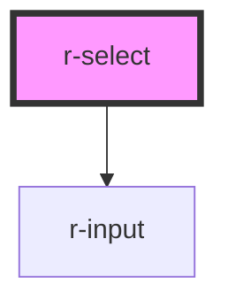

# r-select

<!-- Auto Generated Below -->

## Properties

| Property              | Attribute               | Description                                                | Type                                           | Default                                                                                           |
| --------------------- | ----------------------- | ---------------------------------------------------------- | ---------------------------------------------- | ------------------------------------------------------------------------------------------------- |
| `allowCreate`         | `allow-create`          | Whether creating new items is allowed                      | `boolean`                                      | `false`                                                                                           |
| `clearable`           | `clearable`             | Whether select can be cleared                              | `boolean`                                      | `false`                                                                                           |
| `collapseTags`        | `collapse-tags`         | Whether to collapse tags when multiple                     | `boolean`                                      | `false`                                                                                           |
| `collapseTagsTooltip` | `collapse-tags-tooltip` | Show all tags on hover when collapsed                      | `boolean`                                      | `false`                                                                                           |
| `defaultFirstOption`  | `default-first-option`  | Select first option on enter                               | `boolean`                                      | `false`                                                                                           |
| `disabled`            | `disabled`              | Whether Select is disabled                                 | `boolean`                                      | `false`                                                                                           |
| `filterable`          | `filterable`            | Whether Select is filterable                               | `boolean`                                      | `false`                                                                                           |
| `loading`             | `loading`               | Whether Select is loading data                             | `boolean`                                      | `false`                                                                                           |
| `loadingText`         | `loading-text`          | Text while loading                                         | `string`                                       | `'Loading...'`                                                                                    |
| `maxCollapseTags`     | `max-collapse-tags`     | Max tags to show when collapsed                            | `number`                                       | `1`                                                                                               |
| `multiple`            | `multiple`              | Whether multiple select is activated                       | `boolean`                                      | `false`                                                                                           |
| `multipleLimit`       | `multiple-limit`        | Maximum options user can select (0 = no limit)             | `number`                                       | `0`                                                                                               |
| `noDataText`          | `no-data-text`          | Text when no data                                          | `string`                                       | `'No data'`                                                                                       |
| `noMatchText`         | `no-match-text`         | Text when no match                                         | `string`                                       | `'No matching data'`                                                                              |
| `options`             | --                      | Data of the options                                        | `(SelectOption \| SelectOptionGroup)[]`        | `[]`                                                                                              |
| `placeholder`         | `placeholder`           | Placeholder text                                           | `string`                                       | `'Select'`                                                                                        |
| `props`               | --                      | Configuration for option keys                              | `SelectProps`                                  | `{     value: 'value',     label: 'label',     disabled: 'disabled',     options: 'options',   }` |
| `remote`              | `remote`                | Whether options are loaded from server                     | `boolean`                                      | `false`                                                                                           |
| `size`                | `size`                  | Size of input                                              | `"default" \| "large" \| "small"`              | `'default'`                                                                                       |
| `tagType`             | `tag-type`              | Tag type for multiple select                               | `"danger" \| "info" \| "success" \| "warning"` | `'info'`                                                                                          |
| `value`               | `value`                 | Binding value (single or array for multiple)               | `any`                                          | `''`                                                                                              |
| `valueKey`            | `value-key`             | Unique identity key name for value when value is an object | `string`                                       | `'value'`                                                                                         |

## Events

| Event           | Description | Type                   |
| --------------- | ----------- | ---------------------- |
| `change`        |             | `CustomEvent<any>`     |
| `clear`         |             | `CustomEvent<void>`    |
| `removeTag`     |             | `CustomEvent<any>`     |
| `visibleChange` |             | `CustomEvent<boolean>` |

## Methods

### `setBlur() => Promise<void>`

Blur the select

#### Returns

Type: `Promise<void>`

### `setFocus() => Promise<void>`

Focus the select

#### Returns

Type: `Promise<void>`

## Dependencies

### Depends on

- [r-input](../r-input)

### Graph

----------------------------------------------

*Built with [StencilJS](https://stenciljs.com/)*
