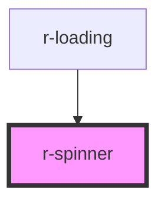

# r-spinner

<!-- Auto Generated Below -->

## Properties

| Property      | Attribute      | Description           | Type                                                                         | Default     |
| ------------- | -------------- | --------------------- | ---------------------------------------------------------------------------- | ----------- |
| `color`       | `color`        | Spinner color         | `"" \| "danger" \| "info" \| "primary" \| "success" \| "warning" \| "white"` | `'primary'` |
| `customSize`  | `custom-size`  | Custom size in pixels | `number`                                                                     | `undefined` |
| `size`        | `size`         | Spinner size          | `"default" \| "large" \| "small"`                                            | `'default'` |
| `strokeWidth` | `stroke-width` | Stroke width          | `number`                                                                     | `4`         |

## Dependencies

### Used by

 - [r-loading](../r-loading)

### Graph

----------------------------------------------

*Built with [StencilJS](https://stenciljs.com/)*
