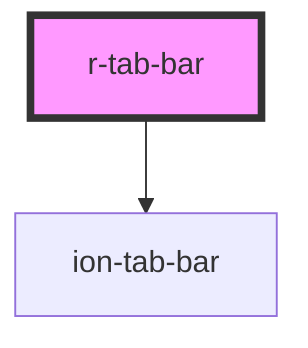

# r-tab-bar

<!-- Auto Generated Below -->

## Properties

| Property      | Attribute      | Description                          | Type                                                                                                            | Default     |
| ------------- | -------------- | ------------------------------------ | --------------------------------------------------------------------------------------------------------------- | ----------- |
| `color`       | `color`        | The tab bar color (Ionic color)      | `"danger" \| "dark" \| "light" \| "medium" \| "primary" \| "secondary" \| "success" \| "tertiary" \| "warning"` | `undefined` |
| `mode`        | `mode`         | The tab bar mode (ios or md)         | `"ios" \| "md"`                                                                                                 | `undefined` |
| `position`    | `position`     | The tab bar position (top or bottom) | `"bottom" \| "top"`                                                                                             | `'bottom'`  |
| `selectedTab` | `selected-tab` | The selected tab                     | `string`                                                                                                        | `undefined` |
| `translucent` | `translucent`  | If true, the tab bar is translucent  | `boolean`                                                                                                       | `false`     |

## Dependencies

### Depends on

- ion-tab-bar

### Graph

----------------------------------------------

*Built with [StencilJS](https://stenciljs.com/)*
