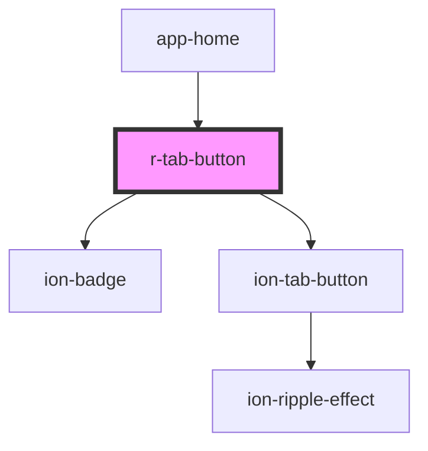

# r-tab-button

<!-- Auto Generated Below -->

## Properties

| Property     | Attribute     | Description                                                                                | Type                                                                                                            | Default     |
| ------------ | ------------- | ------------------------------------------------------------------------------------------ | --------------------------------------------------------------------------------------------------------------- | ----------- |
| `badge`      | `badge`       | The tab button badge                                                                       | `string`                                                                                                        | `undefined` |
| `badgeColor` | `badge-color` | The tab button badge color                                                                 | `"danger" \| "dark" \| "light" \| "medium" \| "primary" \| "secondary" \| "success" \| "tertiary" \| "warning"` | `undefined` |
| `color`      | `color`       | The tab button color (Ionic color)                                                         | `"danger" \| "dark" \| "light" \| "medium" \| "primary" \| "secondary" \| "success" \| "tertiary" \| "warning"` | `undefined` |
| `disabled`   | `disabled`    | If true, the tab button is disabled                                                        | `boolean`                                                                                                       | `false`     |
| `layout`     | `layout`      | The tab button layout (icon-top, icon-start, icon-end, icon-bottom, icon-hide, label-hide) | `"icon-bottom" \| "icon-end" \| "icon-hide" \| "icon-start" \| "icon-top" \| "label-hide"`                      | `undefined` |
| `mode`       | `mode`        | The tab button mode (ios or md)                                                            | `"ios" \| "md"`                                                                                                 | `undefined` |
| `selected`   | `selected`    | If true, the tab button is selected                                                        | `boolean`                                                                                                       | `false`     |
| `tab`        | `tab`         | The tab identifier this button corresponds to                                              | `string`                                                                                                        | `undefined` |

## Dependencies

### Used by

 - [app-home](../app-home)

### Depends on

- ion-badge
- ion-tab-button

### Graph

----------------------------------------------

*Built with [StencilJS](https://stenciljs.com/)*
