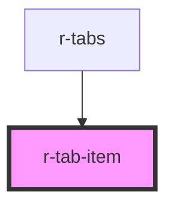

# r-tab-item

<!-- Auto Generated Below -->

## Properties

| Property   | Attribute  | Description                      | Type                                | Default     |
| ---------- | ---------- | -------------------------------- | ----------------------------------- | ----------- |
| `active`   | `active`   | Whether tab is active            | `boolean`                           | `false`     |
| `closable` | `closable` | Whether tab can be closed        | `boolean`                           | `false`     |
| `disabled` | `disabled` | Whether tab is disabled          | `boolean`                           | `false`     |
| `label`    | `label`    | Tab label (display text)         | `string`                            | `undefined` |
| `name`     | `name`     | Tab name (identifier)            | `string`                            | `undefined` |
| `type`     | `type`     | Tab type (inherited from parent) | `"border-card" \| "card" \| "line"` | `'line'`    |

## Events

| Event   | Description | Type                      |
| ------- | ----------- | ------------------------- |
| `close` |             | `CustomEvent<MouseEvent>` |

## Dependencies

### Used by

 - [r-tabs](../r-tabs)

### Graph

----------------------------------------------

*Built with [StencilJS](https://stenciljs.com/)*
