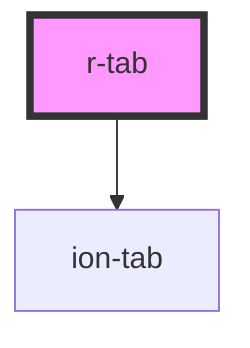

# r-tab

<!-- Auto Generated Below -->

## Properties

| Property         | Attribute         | Description                 | Type                                                                                                            | Default     |
| ---------------- | ----------------- | --------------------------- | --------------------------------------------------------------------------------------------------------------- | ----------- |
| `color`          | `color`           | The tab color (Ionic color) | `"danger" \| "dark" \| "light" \| "medium" \| "primary" \| "secondary" \| "success" \| "tertiary" \| "warning"` | `undefined` |
| `component`      | `component`       | The tab component to render | `string`                                                                                                        | `undefined` |
| `componentProps` | `component-props` | The tab component props     | `any`                                                                                                           | `undefined` |
| `mode`           | `mode`            | The tab mode (ios or md)    | `"ios" \| "md"`                                                                                                 | `undefined` |
| `tab`            | `tab`             | The tab identifier          | `string`                                                                                                        | `undefined` |

## Dependencies

### Depends on

- ion-tab

### Graph

----------------------------------------------

*Built with [StencilJS](https://stenciljs.com/)*
