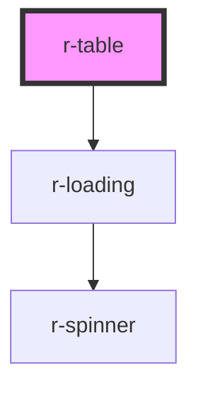

# r-table

<!-- Auto Generated Below -->

## Properties

| Property              | Attribute               | Description                       | Type                              | Default     |
| --------------------- | ----------------------- | --------------------------------- | --------------------------------- | ----------- |
| `border`              | `border`                | Whether to show border            | `boolean`                         | `false`     |
| `columns`             | --                      | Table columns                     | `TableColumn[]`                   | `[]`        |
| `data`                | --                      | Table data                        | `any[]`                           | `[]`        |
| `emptyText`           | `empty-text`            | Empty text                        | `string`                          | `'No data'` |
| `highlightCurrentRow` | `highlight-current-row` | Whether to highlight current row  | `boolean`                         | `false`     |
| `loading`             | `loading`               | Loading state                     | `boolean`                         | `false`     |
| `maxHeight`           | `max-height`            | Max height for scrollable table   | `string`                          | `undefined` |
| `rowKey`              | `row-key`               | Row key for unique identification | `string`                          | `'id'`      |
| `showHeader`          | `show-header`           | Whether to show header            | `boolean`                         | `true`      |
| `size`                | `size`                  | Table size                        | `"default" \| "large" \| "small"` | `'default'` |
| `stripe`              | `stripe`                | Whether to show stripe            | `boolean`                         | `false`     |

## Events

| Event           | Description | Type                                                                             |
| --------------- | ----------- | -------------------------------------------------------------------------------- |
| `cellClick`     |             | `CustomEvent<{ row: any; column: TableColumn; cellValue: any; index: number; }>` |
| `currentChange` |             | `CustomEvent<any>`                                                               |
| `rowClick`      |             | `CustomEvent<{ row: any; index: number; }>`                                      |
| `sortChange`    |             | `CustomEvent<{ prop: string; order: "ascending" \| "descending"; }>`             |

## Dependencies

### Depends on

- [r-loading](../r-loading)

### Graph

----------------------------------------------

*Built with [StencilJS](https://stenciljs.com/)*
