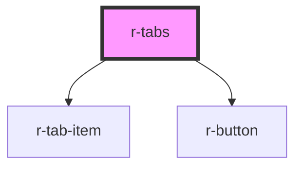

# r-tabs

<!-- Auto Generated Below -->

## Properties

| Property      | Attribute      | Description                            | Type                                     | Default     |
| ------------- | -------------- | -------------------------------------- | ---------------------------------------- | ----------- |
| `addable`     | `addable`      | Whether tabs can be added              | `boolean`                                | `false`     |
| `closable`    | `closable`     | Whether tabs can be closed             | `boolean`                                | `false`     |
| `stretch`     | `stretch`      | Whether tabs stretch to fill container | `boolean`                                | `false`     |
| `tabPosition` | `tab-position` | Tab position                           | `"bottom" \| "left" \| "right" \| "top"` | `"top"`     |
| `type`        | `type`         | Tab type                               | `"border-card" \| "card" \| "line"`      | `"line"`    |
| `value`       | `value`        | Currently active tab                   | `string`                                 | `undefined` |

## Events

| Event       | Description | Type                  |
| ----------- | ----------- | --------------------- |
| `tabAdd`    |             | `CustomEvent<void>`   |
| `tabChange` |             | `CustomEvent<string>` |
| `tabRemove` |             | `CustomEvent<string>` |

## Dependencies

### Depends on

- [r-tab-item](../r-tab-item)
- [r-button](../r-button)

### Graph

----------------------------------------------

*Built with [StencilJS](https://stenciljs.com/)*
