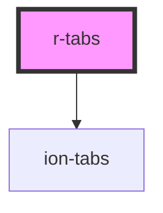

# r-tabs

<!-- Auto Generated Below -->

## Properties

| Property      | Attribute     | Description                       | Type                                                                                                            | Default     |
| ------------- | ------------- | --------------------------------- | --------------------------------------------------------------------------------------------------------------- | ----------- |
| `color`       | `color`       | The tabs color (Ionic color)      | `"danger" \| "dark" \| "light" \| "medium" \| "primary" \| "secondary" \| "success" \| "tertiary" \| "warning"` | `undefined` |
| `mode`        | `mode`        | The tabs mode (ios or md)         | `"ios" \| "md"`                                                                                                 | `undefined` |
| `translucent` | `translucent` | If true, the tabs are translucent | `boolean`                                                                                                       | `false`     |

## Dependencies

### Depends on

- ion-tabs

### Graph

----------------------------------------------

*Built with [StencilJS](https://stenciljs.com/)*
