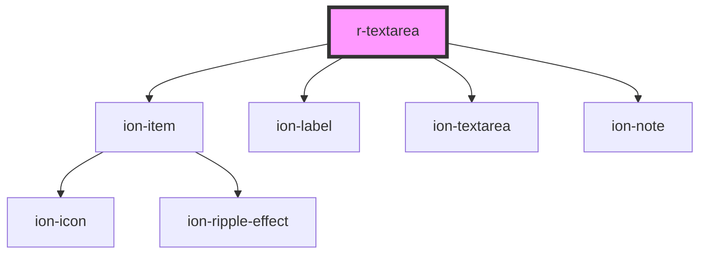

# r-textarea

<!-- Auto Generated Below -->

## Properties

| Property      | Attribute     | Description                                            | Type                                                                                                            | Default     |
| ------------- | ------------- | ------------------------------------------------------ | --------------------------------------------------------------------------------------------------------------- | ----------- |
| `autoGrow`    | `auto-grow`   | If true, the textarea will auto-grow as the user types | `boolean`                                                                                                       | `false`     |
| `color`       | `color`       | The textarea color (Ionic color)                       | `"danger" \| "dark" \| "light" \| "medium" \| "primary" \| "secondary" \| "success" \| "tertiary" \| "warning"` | `undefined` |
| `disabled`    | `disabled`    | If true, the textarea is disabled                      | `boolean`                                                                                                       | `false`     |
| `error`       | `error`       | If true, the textarea has error state                  | `boolean`                                                                                                       | `false`     |
| `errorText`   | `error-text`  | Error message to display                               | `string`                                                                                                        | `undefined` |
| `fill`        | `fill`        | The fill style                                         | `"clear" \| "default" \| "outline" \| "solid"`                                                                  | `undefined` |
| `helperText`  | `helper-text` | Helper text to display                                 | `string`                                                                                                        | `undefined` |
| `label`       | `label`       | The textarea label                                     | `string`                                                                                                        | `undefined` |
| `maxlength`   | `maxlength`   | Maximum number of characters                           | `number`                                                                                                        | `undefined` |
| `minlength`   | `minlength`   | Minimum number of characters                           | `number`                                                                                                        | `undefined` |
| `name`        | `name`        | The textarea name (for form submission)                | `string`                                                                                                        | `undefined` |
| `placeholder` | `placeholder` | Placeholder text                                       | `string`                                                                                                        | `undefined` |
| `readonly`    | `readonly`    | If true, the textarea is readonly                      | `boolean`                                                                                                       | `false`     |
| `required`    | `required`    | If true, the textarea is required                      | `boolean`                                                                                                       | `false`     |
| `rows`        | `rows`        | Number of visible rows                                 | `number`                                                                                                        | `undefined` |
| `value`       | `value`       | The textarea value                                     | `string`                                                                                                        | `undefined` |

## Events

| Event     | Description                                                | Type                            |
| --------- | ---------------------------------------------------------- | ------------------------------- |
| `rBlur`   | Emitted when the textarea loses focus                      | `CustomEvent<FocusEvent>`       |
| `rChange` | Emitted when the textarea value changes (alias for rInput) | `CustomEvent<CustomEvent<any>>` |
| `rFocus`  | Emitted when the textarea receives focus                   | `CustomEvent<FocusEvent>`       |
| `rInput`  | Emitted when the textarea value changes                    | `CustomEvent<CustomEvent<any>>` |

## Dependencies

### Depends on

- ion-item
- ion-label
- ion-textarea
- ion-note

### Graph

----------------------------------------------

*Built with [StencilJS](https://stenciljs.com/)*
