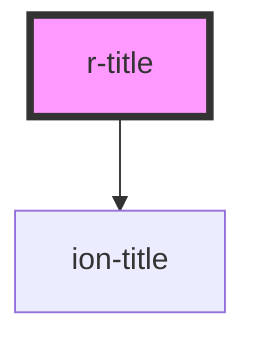

# r-title

<!-- Auto Generated Below -->

## Properties

| Property | Attribute | Description    | Type                 | Default     |
| -------- | --------- | -------------- | -------------------- | ----------- |
| `size`   | `size`    |                | `"large" \| "small"` | `undefined` |
| `text`   | `text`    | The title text | `string`             | `undefined` |

## Dependencies

### Depends on

- ion-title

### Graph

----------------------------------------------

*Built with [StencilJS](https://stenciljs.com/)*
