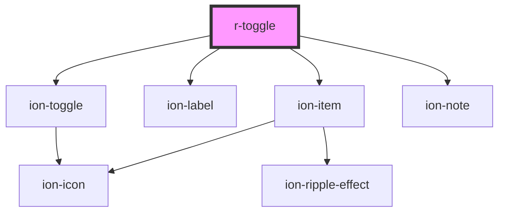

# r-toggle

<!-- Auto Generated Below -->

## Properties

| Property            | Attribute              | Description                                                                 | Type                                                                                                            | Default     |
| ------------------- | ---------------------- | --------------------------------------------------------------------------- | --------------------------------------------------------------------------------------------------------------- | ----------- |
| `alignment`         | `alignment`            | Toggle alignment (start or center)                                          | `"center" \| "start"`                                                                                           | `undefined` |
| `checked`           | `checked`              | If true, the toggle is checked                                              | `boolean`                                                                                                       | `false`     |
| `color`             | `color`                | The toggle color (Ionic color)                                              | `"danger" \| "dark" \| "light" \| "medium" \| "primary" \| "secondary" \| "success" \| "tertiary" \| "warning"` | `undefined` |
| `disabled`          | `disabled`             | If true, the toggle is disabled                                             | `boolean`                                                                                                       | `false`     |
| `enableOnOffLabels` | `enable-on-off-labels` | If true, displays "on" and "off" labels within the toggle for accessibility | `boolean`                                                                                                       | `false`     |
| `error`             | `error`                | If true, the toggle has error state                                         | `boolean`                                                                                                       | `false`     |
| `errorText`         | `error-text`           | Error message to display                                                    | `string`                                                                                                        | `undefined` |
| `fill`              | `fill`                 | The fill style (only applies when formField is true)                        | `"clear" \| "default" \| "outline" \| "solid"`                                                                  | `undefined` |
| `formField`         | `form-field`           | If true, wraps toggle in ion-item for form field styling                    | `boolean`                                                                                                       | `false`     |
| `helperText`        | `helper-text`          | Helper text to display                                                      | `string`                                                                                                        | `undefined` |
| `justify`           | `justify`              | Justify content (start, end, space-between)                                 | `"end" \| "space-between" \| "start"`                                                                           | `undefined` |
| `label`             | `label`                | The toggle label                                                            | `string`                                                                                                        | `undefined` |
| `labelPlacement`    | `label-placement`      | Label placement relative to the toggle                                      | `"end" \| "fixed" \| "stacked" \| "start"`                                                                      | `undefined` |
| `mode`              | `mode`                 | The toggle mode (ios or md)                                                 | `"ios" \| "md"`                                                                                                 | `undefined` |
| `name`              | `name`                 | The toggle name (for form submission)                                       | `string`                                                                                                        | `undefined` |
| `required`          | `required`             | If true, the toggle is required                                             | `boolean`                                                                                                       | `false`     |
| `value`             | `value`                | The toggle value                                                            | `string`                                                                                                        | `undefined` |

## Events

| Event     | Description                                   | Type                            |
| --------- | --------------------------------------------- | ------------------------------- |
| `rBlur`   | Emitted when the toggle is blurred            | `CustomEvent<CustomEvent<any>>` |
| `rChange` | Emitted when the toggle checked state changes | `CustomEvent<CustomEvent<any>>` |
| `rFocus`  | Emitted when the toggle is focused            | `CustomEvent<CustomEvent<any>>` |

## Dependencies

### Depends on

- ion-item
- ion-label
- ion-toggle
- ion-note

### Graph

----------------------------------------------

*Built with [StencilJS](https://stenciljs.com/)*
