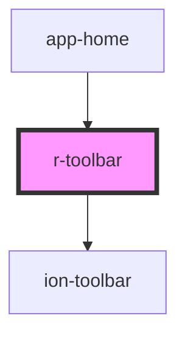

# r-toolbar

Toolbar component that wraps Ionic toolbar. Provides a consistent toolbar structure for applications with support for buttons and content slots.

## What is a Toolbar?

A toolbar is a horizontal bar that contains action buttons, titles, and other controls. It's typically placed at the top or bottom of a screen to provide navigation and actions.

## When to Use Toolbars

### 1. **Inside Headers (Most Common)**
Toolbars are typically placed inside headers to provide navigation and actions:

```html
<r-header title="My App">
  <r-toolbar color="primary">
    <ion-buttons slot="start">
      <ion-button>
        <ion-icon slot="icon-only" name="menu-outline"></ion-icon>
      </ion-button>
    </ion-buttons>
    <ion-buttons slot="end">
      <ion-button>
        <ion-icon slot="icon-only" name="search-outline"></ion-icon>
      </ion-button>
    </ion-buttons>
  </r-toolbar>
</r-header>
```

### 2. **Standalone Toolbars**
Use standalone toolbars for:
- **Bottom navigation bars** (footer toolbars)
- **Action bars** within content areas
- **Floating toolbars** for specific actions

```html
<!-- Bottom toolbar (footer) -->
<ion-footer>
  <r-toolbar color="primary">
    <ion-title>Footer Actions</ion-title>
    <ion-buttons slot="end">
      <ion-button>Save</ion-button>
      <ion-button>Cancel</ion-button>
    </ion-buttons>
  </r-toolbar>
</ion-footer>
```

### 3. **Multiple Toolbars in Header**
You can stack multiple toolbars in a header for complex layouts:

```html
<r-header>
  <!-- Primary toolbar -->
  <r-toolbar color="primary">
    <ion-title>Page Title</ion-title>
    <ion-buttons slot="end">
      <ion-button>
        <ion-icon slot="icon-only" name="more-outline"></ion-icon>
      </ion-button>
    </ion-buttons>
  </r-toolbar>
  
  <!-- Secondary toolbar (e.g., for tabs or filters) -->
  <r-toolbar color="light">
    <ion-segment value="all">
      <ion-segment-button value="all">All</ion-segment-button>
      <ion-segment-button value="favorites">Favorites</ion-segment-button>
    </ion-segment>
  </r-toolbar>
</r-header>
```

## Where to Place Toolbars

### ✅ **Top of Screen (Header)**
Most common placement - inside `r-header` or `ion-header`:

```html
<r-header title="My App">
  <r-toolbar color="primary">
    <!-- Navigation and actions -->
  </r-toolbar>
</r-header>
```

### ✅ **Bottom of Screen (Footer)**
For action buttons or secondary navigation:

```html
<ion-footer>
  <r-toolbar color="primary">
    <ion-buttons slot="start">
      <ion-button>Previous</ion-button>
    </ion-buttons>
    <ion-buttons slot="end">
      <ion-button>Next</ion-button>
    </ion-buttons>
  </r-toolbar>
</ion-footer>
```

### ✅ **Inside Content Areas**
For contextual actions within page content:

```html
<ion-content>
  <r-toolbar color="light">
    <ion-title>Section Actions</ion-title>
    <ion-buttons slot="end">
      <ion-button>Edit</ion-button>
    </ion-buttons>
  </r-toolbar>
  <!-- Content here -->
</ion-content>
```

## r-header vs r-toolbar

### **r-header** (Use for full page headers)
- Wraps `ion-header` (provides header container)
- Includes title prop for convenience
- Best for: Main page headers with title and actions

```html
<r-header title="My App" color="primary">
  <ion-buttons slot="start">...</ion-buttons>
  <ion-buttons slot="end">...</ion-buttons>
</r-header>
```

### **r-toolbar** (Use for flexible toolbars)
- Wraps `ion-toolbar` only (no header container)
- More flexible - can be used anywhere
- Best for: 
  - Inside custom headers
  - Footer toolbars
  - Multiple toolbars in one header
  - Standalone action bars

```html
<!-- Inside header -->
<ion-header>
  <r-toolbar color="primary">
    <ion-title>Title</ion-title>
  </r-toolbar>
</ion-header>

<!-- Or standalone -->
<r-toolbar color="primary">
  <ion-title>Standalone Toolbar</ion-title>
</r-toolbar>
```

## Common Use Cases

### 1. **Navigation Toolbar**
```html
<r-header title="Products">
  <r-toolbar color="primary">
    <ion-buttons slot="start">
      <ion-button>
        <ion-icon slot="icon-only" name="arrow-back-outline"></ion-icon>
      </ion-button>
    </ion-buttons>
    <ion-buttons slot="end">
      <ion-button>
        <ion-icon slot="icon-only" name="cart-outline"></ion-icon>
      </ion-button>
    </ion-buttons>
  </r-toolbar>
</r-header>
```

### 2. **Action Toolbar (Footer)**
```html
<ion-footer>
  <r-toolbar color="primary">
    <ion-buttons slot="start">
      <ion-button fill="outline">Cancel</ion-button>
    </ion-buttons>
    <ion-buttons slot="end">
      <ion-button>Save</ion-button>
    </ion-buttons>
  </r-toolbar>
</ion-footer>
```

### 3. **Search Toolbar**
```html
<r-toolbar color="light">
  <ion-searchbar placeholder="Search..."></ion-searchbar>
  <ion-buttons slot="end">
    <ion-button>
      <ion-icon slot="icon-only" name="filter-outline"></ion-icon>
    </ion-button>
  </ion-buttons>
</r-toolbar>
```

### 4. **Tab Toolbar**
```html
<r-toolbar color="primary">
  <ion-segment value="home">
    <ion-segment-button value="home">Home</ion-segment-button>
    <ion-segment-button value="about">About</ion-segment-button>
    <ion-segment-button value="contact">Contact</ion-segment-button>
  </ion-segment>
</r-toolbar>
```

## Best Practices

1. **Use r-header for simple page headers** - It includes the header container and title
2. **Use r-toolbar for flexibility** - When you need multiple toolbars or custom placement
3. **Place primary actions on the right** - Use `slot="end"` for main actions
4. **Place navigation on the left** - Use `slot="start"` for back buttons and menus
5. **Keep toolbars consistent** - Use the same color and style across your app
6. **Limit button count** - Too many buttons can clutter the toolbar (3-4 max recommended)

<!-- Auto Generated Below -->


## Properties

| Property      | Attribute     | Description                         | Type            | Default     |
| ------------- | ------------- | ----------------------------------- | --------------- | ----------- |
| `color`       | `color`       | The toolbar color (Ionic color)     | `string`        | `undefined` |
| `mode`        | `mode`        | The toolbar mode (ios or md)        | `"ios" \| "md"` | `undefined` |
| `noBorder`    | `no-border`   | If true, the toolbar has no border  | `boolean`       | `false`     |
| `translucent` | `translucent` | If true, the toolbar is translucent | `boolean`       | `false`     |


## Dependencies

### Used by

 - [app-home](../app-home)

### Depends on

- ion-toolbar

### Graph


----------------------------------------------

*Built with [StencilJS](https://stenciljs.com/)*
